### 【1】(2021)低轨卫星星座物联网业务量建模  程一凡* 曲至诚 张更新
物联网覆盖 到低轨卫星  
1)由于 地面物联网中有大量与人为行为息息相关的业务比 如智能家居、智慧交通等等,因此地面蜂窝物联网 的业务需求受人类活动的影响较大,而卫星物联网 作为地面网络的补充,大多业务分布在无人区,因 此其业务需求受人类活动的影响较小,但与地理信 息密切相关;(2)由于低轨卫星物联网覆盖区域非 常大,因此对于单颗低轨卫星而言,其服务的物联 网节点数量远超过蜂窝物联网的地面基站。虽然卫 星物联网业务分布稀疏,但汇聚密度大,即单颗卫 星承载量多,而蜂窝物联网业务可根据业务大小, 合理地规划蜂窝设计,虽然业务分布密度大,但是 汇聚密度小,即单个基站承载量少;(3)由于卫星 通信的通信距离和路径损耗远超过地面蜂窝通信, 因此相较于地面蜂窝物联网,卫星物联网不适用于 时敏的控制业务,其业务需求普遍对时延的要求不高。

,由于单颗卫 星的覆盖范围可以达到数万平方公里量级[4],其覆 盖区域将跨越多种地理环境。同时,由于低轨卫星 相对地面高速运动,其服务范围内的终端特征将快 速时变。因此,全球范围内的卫星物联网业务量分 布存在较明显的空时不均匀性[5]。综上所述,研究 与地理位置信息相关的物联网模型[6]是解决卫星物 联网海量节点随机接入业务碰撞的重要基础

    分析了低轨卫星物联网中大量存在的异步流量的叠加特性
    
    低轨卫星物联网的业务类型分为3类:
    (1)数据采集:
                参数采集类,低速、非时敏;
                图像/视频采集类,高速、时敏/非时敏;
    (2)数据广播:低速/高速、时敏/非时敏;   
    (3)指挥控制/交互:低速、时敏

    通信相关的基本要素主要有6个:附着特性、触发特性、 流量特性、移动性、可靠性和实时性、忙时特性[9]。
【1.9】王海陶, 宋小明, 卢纪宇. 物联网业务特征及业务模型研究[J]. 广西通信技术, 2012(3): 43–49. doi: 10.3969/j.issn.10083545.2012.03.011. WANG Haitao, SONG Xiaoming, and LU Jiyu. The research on characteristics and service model of internet of things[J]. Guangxi Communication Technology, 2012(3): 43–49. doi: 10.3969/j.issn.1008-3545.2012.03.011
        
    高动态、广覆盖特性[8]
【1.8】**沈俊, 高卫斌, 张更新. 低轨卫星物联网的发展背景、业务特 点和技术挑战[J]. 电信科学, 2019, 35(5): 2019089.  SHEN Jun, GAO Weibin, and ZHANG Gengxin. Developing background, service characteristics and challenges of LEO IoT[J]. Telecommunications Science, 2019, 35(5): 2019089.**

国际电信联盟给出了一些地面物联网业 务的数据采集周期[10]
#### LEO
低地球轨道（Low Earth Orbit, LEO），是指距离地球表面较近的航天器运行轨道。虽然没有全球统一的严格定义，但通常指高度在160公里至2000公里之间的近圆形轨道。

LEO是太空中最繁忙的区域，具有以下独特的物理特性：  
轨道高度：范围大致在160公里至2000公里之间。需要注意，由于在160公里以下大气阻力过大，轨道难以维持；   
而为了避开大气层影响，实用轨道高度通常不低于300公里。  
轨道速度：卫星飞行速度极快，约为7.8公里/秒。  
运行周期：绕地球一圈大约需要90分钟至2小时

LEO的“近地”特点带来了诸多关键应用：

高分辨率对地观测：由于离地面近，是光学成像、雷达监测和气象卫星的理想轨道，能获取高分辨率的图像和数据。  
低延迟通信：信号传输距离短，时延极低（可小于20毫秒），使其成为全球卫星互联网（如Starlink、OneWeb）的核心。  
载人航天：国际空间站（ISS）和中国天宫空间站都运行在约400公里高度的LEO，便于宇航员往返和物资补给。 
科研与新技术验证：是进行微重力实验、天文观测和测试新型航天技术的理想平台

挑战
覆盖范围有限：单颗卫星覆盖区域小，需组成庞大星座（数十至数千颗）才能实现全球覆盖。              
存在大气阻力：尽管大气极其稀薄，但仍会造成轨道衰减，卫星需定期消耗燃料调整轨道。   
轨道寿命有限：受大气阻力等因素影响，LEO卫星的典型设计寿命约为7到10年。   
空间碎片与碰撞风险：随着卫星数量激增，碰撞风险和空间碎片问题日益突出。     
对天文观测的干扰：大量卫星反射的阳光可能干扰光学和射电天文观测  

    结合[1.md](L参考文件思考/参考.md)文件【1】的说法
    有 成为热点 卫星发射多 服务要求复杂 因为量产了，成本低了所以部署容易了
    故此我仿写应当考虑 低延迟通信 高分辨率对地观测 速度快 周期短的方面
    又由于换代快的特点 有着广阔的商业前景
    广覆盖、高动态的特点,
    思考 
        是否有可能对不同服务 可有不同应对手段？
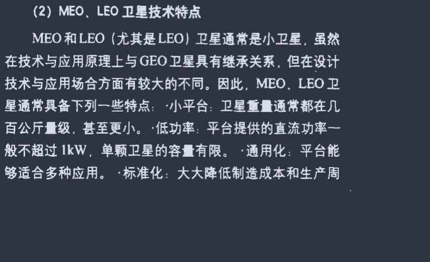
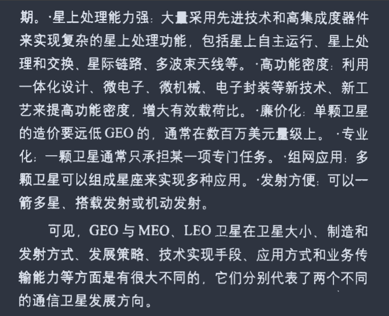
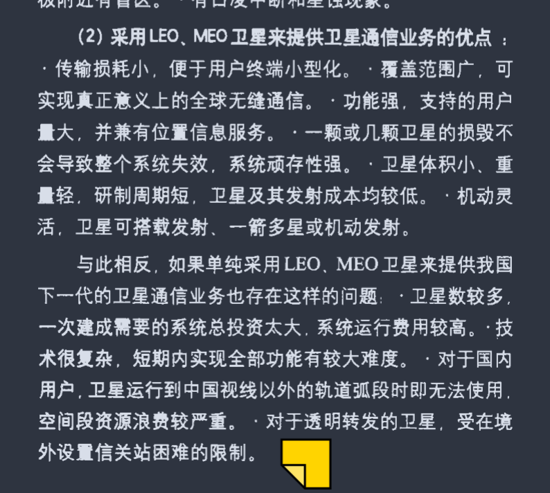

    提问：卫星抵抗个别卫星被损毁的应对手段
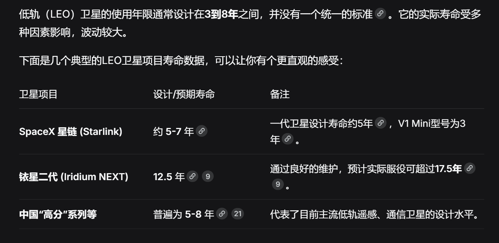
    
    提问 太阳帆抵抗 思考 在收起和释放太阳帆的能耗和燃料损耗谁更加优良？

3.1 业务量叠加  由Palm-Kinchinte定理可知,大量业务流量的 叠加可以由一个泊松过程近似表示。Palm-Kinchinte 定理的具体内容如下:  n λi Xi  考虑 个到达强度为 、到达时间间隔 的独 立同分布且相互独立的更新过程,每个过程的期望
#### Palm-Kinchinte定理
更常见的名称是 **Palm–Khintchine定理 (Palm–Khintchine theorem)**。

这是一个在**概率论**和**排队论**中非常重要的定理。简单来说，它解释了为什么在现实世界中，看似杂乱无章的随机事件（如电话呼叫、网络数据包到达）可以用数学模型“泊松过程”来近似描述。 核心思想：多个“普通”随机过程叠加，趋向“泊松”

该定理的核心思想是：**将大量独立的、一般的“更新过程”叠加在一起，其整体效果会趋近于一个“泊松过程”**。

*   **更新过程 (Renewal Process)**：可以理解为一系列随机发生的事件，比如一台机器故障后修好、再故障、再修好……事件间的间隔时间是独立同分布的随机变量。
*   **泊松过程 (Poisson Process)**：一种理想化的随机过程，其特点是事件在任意时间点发生的概率是均等的，且相互独立，例如放射性衰变。

Palm–Khintchine定理告诉我们，即使每个独立的事件源（更新过程）并不完全符合泊松分布，但只要事件源的数量足够多，它们叠加后的总体流量就会非常接近一个泊松过程。

设我们有 \( m \) 个独立的更新过程 \( \{N_i(t), t \ge 0\} \)，它们的叠加为 \( N(t) = \sum_{i=1}^{m} N_i(t) \)。当 \( m \) 趋向于无穷大时，\( N(t) \) 在分布上收敛于一个泊松过程。

 主要应用

这个定理为很多领域提供了理论基石：

*   **排队论 (Queuing Theory)**：用于模拟电话交换中心的大量呼叫、网络服务器的数据包请求等场景。
*   **可靠性工程 (Reliability Engineering)**：用于模拟由大量独立部件组成的复杂系统（如计算机网络、电信系统）的故障模式。
️ 注意区分：Palm–Khintchine “定理”与“方程”

在搜索时，你可能还会遇到 **Palm-Khinchin equations**。它们是两个不同的概念：

*   **Palm–Khintchine 定理**：是关于**多个过程叠加**的**极限定理**。
*   **Palm-Khinchin 方程**：是描述**单个**平稳点过程内部性质的**积分方程**，揭示了其“典型”时间间隔的分布与其“ Palm 分布”之间的关系。

Palm–Khintchine定理的核心贡献在于，它为“多个独立随机事件的叠加可以用泊松过程来近似”这一广泛使用的建模方法，提供了坚实的数学理论基础。

表 2 低轨卫星星座物联网的潜在应用及其特性  地理环境 潜在业务种类 业务强度 设备部署密度  海 水文监测 低 非常低 岛  周边水文监测 较低  较低 岛上环境监测 较低 山 山体滑坡灾害监测 较高 中等 高原  地下水监测 中  高 地震灾害医疗物资运转 中 平原  战场感应 低  非常低 高效运转的物资体系 低 盆地 应急指挥 中 中等 沙漠  植被监测系统 低  较低 沙漠环境监测 较低 冰盖  边缘区域浮冰自动提取 低  低 关键区域航空探测 低 丘陵  土壤墒情监测 较低  较低 水资源监测 较低 草原  畜禽的生产及管理过程 较高  高 输电管理系统 中 裂谷 地裂运动监测 高 低

王艳红, 李蕊, 张文娟. 任务到达时间服从泊松分布的随机排 序[J]. 西安工业大学学报, 2016, 36(1): 5–7. doi: 10.16185/  [15]  j.jxatu.edu.cn.2016.01.002.
#### QoS

QoS的重要性
在IP网络的业务可以分为实时业务和非实时业务。实时业务往往占据固定带宽，对网络质量变化感知明显，对网络质量的稳定性要求高，例如语音业务。非实时业务所占带宽难以预测，经常会出现突发流量。突发流量会导致网络质量下降，会引起网络拥塞，增加转发时延，严重时还会产生丢包，导致业务质量下降甚至不可用。

解决网络拥塞的最好的办法是增加网络的带宽，但从运营、维护的成本考虑，这是不现实的，最有效的解决方案就是应用一个“有保证”的策略对网络流量进行管理。

QoS一般针对网络中有突发流量时需要保障重要业务质量的场景。如果业务长时间达不到服务质量要求（例如业务流量长时间超过带宽限制），需要考虑对网络扩容或使用专用设备基于上层应用去控制业务。

近几年，视频的应用出现了爆炸式的增长，现在几乎每个人都拥有一部能够随时随地拍摄高分辨率视频的智能手机。同时随着社交网站的涌现，分享和发布视频成了每个人的日常行为，人们不论身在何处都可以将自己制作的视频发布出去与他人分享。对于企业来说，高清视频会议，高清视频监控等应用，也在网络中产生了大量的高清视频流量。与语音流量相比，视频流量占用的带宽更多，也更不稳定，特别是一些交互类视频，对实时性要求非常高。另外，随着无线网络的发展，越来越多的用户和企业都开始使用无线终端，而无线终端会随着用户的移动而不断变化位置，导致网络中的流量更加的不可预测。因此QoS方案设计也面临更多的挑战。

QoS的服务模型
如何在网络中通过部署来保证QoS的度量指标在一定的合理范围内，从而提高网络的服务质量呢？这就涉及到QoS模型。需要说明的是，QoS模型不是一个具体功能，而是端到端QoS设计的一个方案。例如，网络中的两个主机通信时，中间可能会跨越各种各样的设备。只有当网络中所有设备都遵循统一的QoS服务模型时，才能实现端到端的质量保证。

下面介绍主流的三大QoS模型。其中，华为公司的交换机、路由器、防火墙、WLAN等产品均支持配置基于DiffServ服务模型的QoS业务。

Best-Effort服务模型：尽力而为
Best-Effort是最简单的QoS服务模型，用户可以在任何时候，发出任意数量的报文，而且不需要通知网络。提供Best-Effort服务时，网络尽最大的可能来发送报文，但对时延、丢包率等性能不提供任何保证。Best-Effort服务模型适用于对时延、丢包率等性能要求不高的业务，是现在Internet的缺省服务模型，它适用于绝大多数网络应用，如FTP、E-Mail等。

IntServ服务模型：预留资源
IntServ模型是指用户在发送报文前，需要通过信令（Signaling）向网络描述自己的流量参数，申请特定的QoS服务。网络根据流量参数，预留资源以承诺满足该请求。在收到确认信息，确定网络已经为这个应用程序的报文预留了资源后，用户才开始发送报文。用户发送的报文应该控制在流量参数描述的范围内。网络节点需要为每个流维护一个状态，并基于这个状态执行相应的QoS动作，来满足对用户的承诺。

IntServ模型使用了RSVP（Resource Reservation Protocol）协议作为信令，在一条已知路径的网络拓扑上预留带宽、优先级等资源，路径沿途的各网元必须为每个要求服务质量保证的数据流预留想要的资源，通过RSVP信息的预留，各网元可以判断是否有足够的资源可以使用。只有所有的网元都给RSVP提供了足够的资源，“路径”方可建立。

DiffServ服务模型：差分服务
DiffServ模型的基本原理是将网络中的流量分成多个类，每个类享受不同的处理，尤其是网络出现拥塞时不同的类会享受不同级别的处理，从而得到不同的丢包率、时延以及时延抖动。同一类的业务在网络中会被聚合起来统一发送，保证相同的时延、抖动、丢包率等QoS指标。

Diffserv模型中，业务流的分类和汇聚工作在网络边缘由边界节点完成。边界节点可以通过多种条件（比如报文的源地址和目的地址、ToS域中的优先级、协议类型等）灵活地对报文进行分类，对不同的报文设置不同的标记字段，而其他节点只需要简单地识别报文中的这些标记，即可进行资源分配和流量控制。

与Intserv模型相比，DiffServ模型不需要信令。在DiffServ模型中，应用程序发出报文前，不需要预先向网络提出资源申请，而是通过设置报文的QoS参数信息，来告知网络节点它的QoS需求。网络不需要为每个流维护状态，而是根据每个报文流指定的QoS参数信息来提供差分服务，即对报文的服务等级划分，有差别地进行流量控制和转发，提供端到端的QoS保证。DiffServ模型充分考虑了IP网络本身灵活性、可扩展性强的特点，将复杂的服务质量保证通过报文自身携带的信息转换为单跳行为，从而大大减少了信令的工作，是当前网络中的主流服务模型。

基于DiffServ模型的QoS组成
基于Diffserv模型的QoS业务主要分为以下几大类：

报文分类和标记

要实现差分服务，需要首先将数据包分为不同的类别或者设置为不同的优先级。报文分类即把数据包分为不同的类别，可以通过MQC配置中的流分类实现。报文标记即为数据包设置不同的优先级，可以通过优先级映射和重标记优先级实现。不同的报文使用不同的QoS优先级，例如VLAN报文使用802.1p，IP报文使用DSCP，MPLS报文使用EXP。

流量监管、流量整形和接口限速

流量监管和流量整形可以将业务流量限制在特定的带宽内，当业务流量超过额定带宽时，超过的流量将被丢弃或缓存。其中，将超过的流量丢弃的技术称为流量监管，将超过的流量缓存的技术称为流量整形。接口限速分为基于接口的流量监管和基于接口的流量整形。

拥塞管理和拥塞避免

拥塞管理在网络发生拥塞时，将报文放入队列中缓存，并采取某种调度算法安排报文的转发次序。而拥塞避免可以监督网络资源的使用情况，当发现拥塞有加剧的趋势时采取主动丢弃报文的策略，通过调整流量来解除网络的过载。

其中，报文分类和标记是实现差分服务的前提和基础；流量监管、流量整形、接口限速、拥塞管理和拥塞避免从不同方面对网络流量及其分配的资源实施控制，是提供差分服务的具体体现。

各种QoS技术在网络设备上的处理顺序如下图所示。
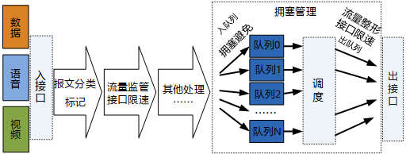
QoS技术处理流程

#### Grubbs准则

**格拉布斯准则（Grubbs' Test）**，也叫**最大标准化残差检验（Maximum Normed Residual Test）**，是一种用于检测单变量数据集中**单个异常值**的统计学方法。它由弗兰克·格拉布斯（Frank E. Grubbs）于1950年提出。

其核心思想是：计算数据中**偏离均值最远**的那个点与均值的差距（以标准差为单位），如果这个差距过大，超过某个临界值，就判定该点为异常值。

*   **核心假设**：数据应**近似服从正态分布**。在使用前，最好先通过正态性检验（如Shapiro-Wilk检验）或绘图（如Q-Q图）进行验证。
*   **迭代检测**：该检验**一次只能检测一个异常值**。找到并移除一个异常值后，需对剩余数据**重复检验**，直到没有异常值为止。
*   **样本量限制**：当样本量**过小（如n ≤ 6）** 时，检验结果可能不可靠，容易将正常点误判为异常值。

格拉布斯检验是一种假设检验，其步骤如下：

1.  **提出假设**：
    *   **零假设 (H₀)**：数据集中没有异常值。
    *   **备择假设 (Hₐ)**：数据集中**恰有一个**异常值。

2.  **计算检验统计量 (G)**：
    检验统计量是数据点与均值偏差的**最大值**除以**标准差**。

    *   **双侧检验**（同时检验最大值和最小值是否为异常值）：
        $$G = \frac{\max_{i=1,\ldots,n} |Y_i - \bar{Y}|}{s}$$
        其中，\( \bar{Y} \) 是样本均值，\( s \) 是样本标准差。

    *   **单侧检验**（只检验最大值或最小值）：
        *   检验**最大值**是否为异常值：\( G = \frac{Y_{max} - \bar{Y}}{s} \)
        *   检验**最小值**是否为异常值：\( G = \frac{\bar{Y} - Y_{min}}{s} \)

3.  **确定临界值 (G_critical)**：
    临界值与**样本量(n)**、**显著性水平(α)** 以及检验类型（单侧/双侧）有关。其计算公式较为复杂，通常通过查表获得。
    *   对于**双侧检验**，临界值 \( G_{critical} \) 的计算公式为：
        $$G_{critical} = \frac{n-1}{\sqrt{n}} \sqrt{\frac{t^2_{\alpha/(2n), n-2}}{n-2 + t^2_{\alpha/(2n), n-2}}}$$
        其中，\( t_{\alpha/(2n), n-2} \) 是自由度为 \( n-2 \) 的t分布上侧分位数。
    *   **常用临界值表（摘录）**：以下是部分显著性水平(α)下的临界值。

| 样本量 (n) | α = 0.05 | α = 0.01 |
| :--- | :--- | :--- |
| 3 | 1.155 | 1.155 |
| 4 | 1.481 | 1.496 |
| 5 | 1.715 | 1.764 |
| 6 | 1.887 | 1.973 |
| 7 | 2.020 | 2.139 |
| 8 | 2.126 | 2.274 |
| 9 | 2.215 | 2.387 |
| 10 | 2.290 | 2.482 |

4.  **做出决策**：
    *   如果 **G > G_critical**，则拒绝零假设(H₀)，判定该离均值最远的点为**异常值**。
    *   否则，没有足够证据表明存在异常值。

 📊 完整示例

假设有6个观测值：`0.82, 0.78, 0.80, 0.91, 0.79, 0.76`。

1.  **计算**：样本均值 \( \bar{Y} = 0.81 \)，样本标准差 \( s \approx 0.053 \)。
2.  **计算统计量**：与均值偏差最大的点是 `0.91`（偏差为 `0.10`）。因此，检验统计量 \( G = 0.10 / 0.053 \approx 1.89 \)。
3.  **查临界值**：查表得，当 n=6，α=0.05 时，\( G_{critical} = 1.887 \)。
4.  **判断**：因为 \( G (1.89) > G_{critical} (1.887) \)，所以判定 `0.91` 为异常值，应予剔除。

💡 注意事项与扩展
*适用场景*：Grubbs检验特别适合**样本量较小**（如n<100）的情况，比简单的3σ准则（拉依达准则）更可靠。
*多个异常值*：如果数据集中可能存在**多个异常值**，建议使用**Tietjen-Moore检验**或**广义极值学生化偏差(GESD)检验**。
*软件实现*：主流统计软件和编程语言都支持Grubbs检验，例如 **R语言** (`grubbs.test` 函数)、**Python** (`outliers` 库中的 `grubbs` 模块) 以及 **MATLAB**。

总而言之，格拉布斯准则是一种严谨的异常值检测方法，适用于数据近似正态分布且样本量适中的场景。

如果想了解它在Python或R中的具体代码实现，或者与其他异常值检测方法的对比，可以随时再问我。

##### 网格分析法
网格GIS是一种将地理空间数据组织成网格（格网）形式的地理信息系统。每个网格单元（通常称为“像元”或“格网单元”）代表特定的空间范围，具有固定的大小和形状。这种结构使得数据的存储、处理和分析更加高效。

【1.3] 张更新, 揭晓, 曲至诚. 低轨卫星物联网的发展现状及面临的挑战[J]. 物联网学报, 2017, 1(3): 6–9.  ZHANG Gengxin, JIE Xiao, and QU Zhicheng. Development status and challenges of LEO IoT[J]. Chinese  Journal on Internet of Things, 2017, 1(3): 6–9
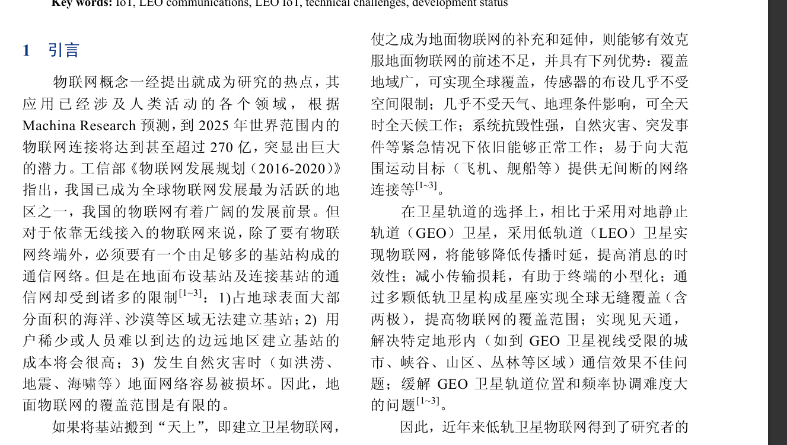
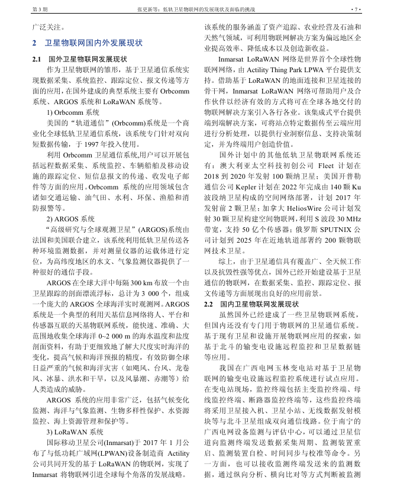
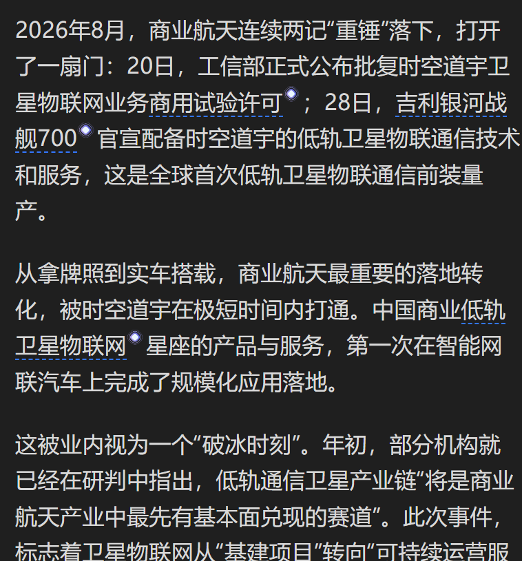
你这瓜保真吗 这个怎么去找消息源的ref

### （25）GEO 卫星机动识别的自适应深度学习方法
啧 这是地面识别卫星用的 nnd
#### 摄动力（Perturbation Force）
天体或航天器在轨道运动中受到的除中心天体点质量引力之外的所有附加力，会引起轨道参数（如半长轴、偏心率、倾角等）随时间变化
#### 空间目标监视系统
空间监视网”(Space surveillance network,SSN  
是对卫星、空间碎片及宇宙飞行物等空间目标进行探测、跟踪与识别的技术体系，主要由地基雷达、光学望远镜和无线电探测器组成监视网，具备获取轨道参数、监测潜在威胁及数据分发功能 [1-2]。其监测对象涵盖工作卫星、失效航天器、助推火箭残骸等，应用于军事预警与碰撞规避
### 逻辑回归
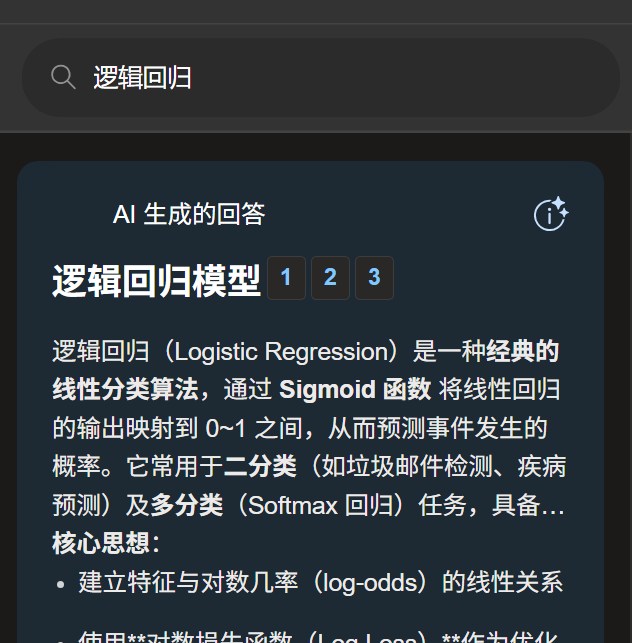
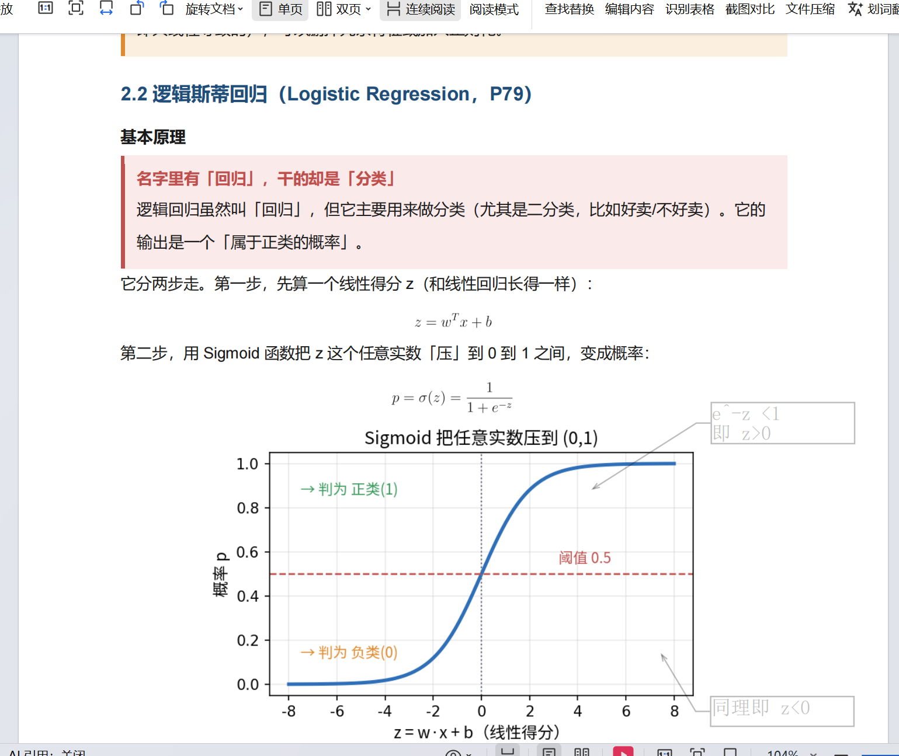
#### SVM
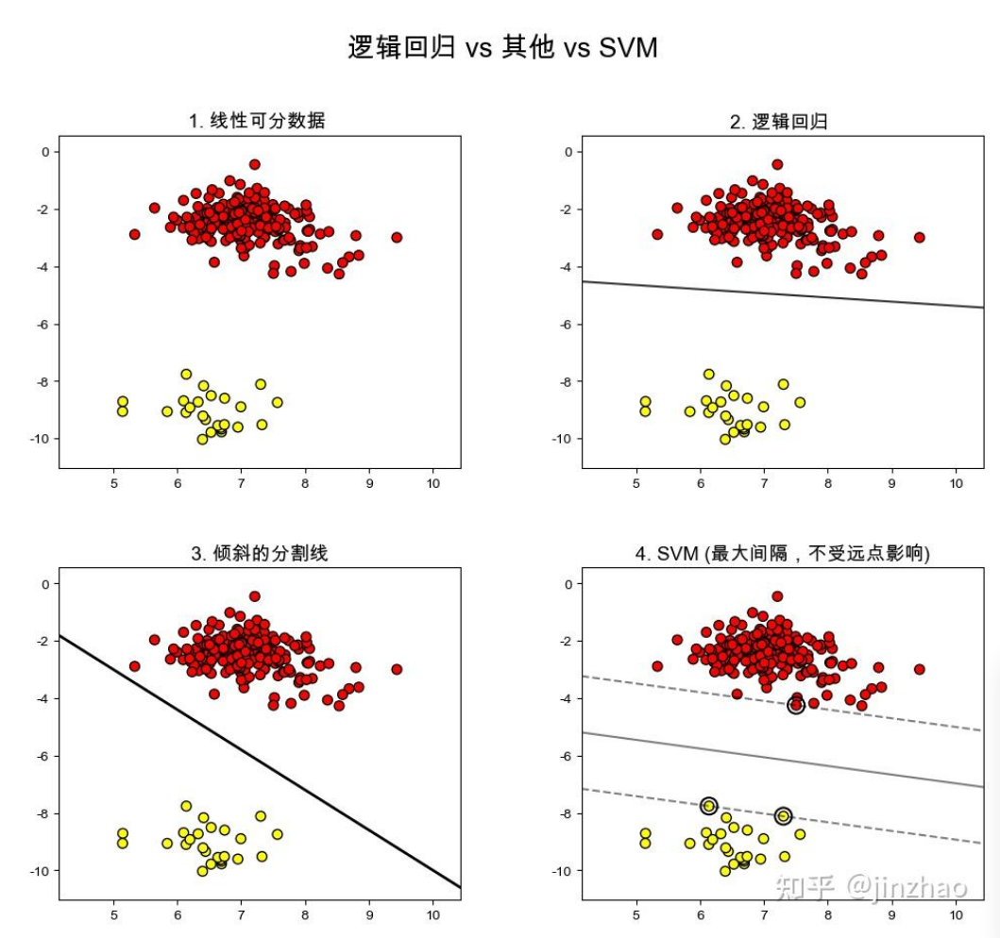
【svm 博客】https://zhuanlan.zhihu.com/p/1980319951496708229
### EIRP 等效全向辐射功率
EIRP/ERP(有效辐射功率)  
EIRP：等效全向辐射功率(Effective Isotropic Radiated Power) ,   
为无线电发射机供给天线的功率与在给定方向上天线绝对增益的乘积。各方向具有相同单位增益的理想全向天线，
通常作为无线通信系统的参考天线。EIRP定义为：EIRP=Pt*Gt，它表示同全向天线相比，可由发射机获得的在最大天线增益方向上的 发射功率。
Pt表示发射机的发射功率，Gt表示发射天线的天线增益。在无线通信工程中，通常用来衡量干扰的强度，以及发射机发射强信号的能力.

ERP：有效辐射功率 (effective radiated power ).   
无线电发射机供给天线的功率和在给定方向上该天线相对于半波偶极振子的增益的乘积。
实际上用有效发射功率ERP代替EIRP来表示同半波耦极子天线相比的最大发射功率。注：耦极子天线具有1.64的增益（2.15dB），
因此，ERP比EIRP低2.15dB
#### G/T

G/T（增益与系统噪声温度比）

定义：G/T 是天线增益（Gain, G）与系统噪声温度（System Noise Temperature, T）的比值，单位通常是 dB/K。

含义：它反映了接收系统的信号接收能力与噪声干扰之间的关系。简单来说，G/T 值越高，说明接收系统越能从噪声中“挑出”有用的信号，性能就越好。

理解方式：

G（增益）：天线接收信号的能力，数值越大，接收信号越强。
————————————————
版权声明：本文为CSDN博主「TaoSense」的原创文章，遵循CC 4.0 BY-SA版权协议，转载请附上原文出处链接及本声明。
原文链接：https://blog.csdn.net/Tao2016/article/details/146464940

G/T 是接收端的指标，关注的是“听清楚”的能力。

EIRP 是发射端的指标，关注的是“喊出去”的强度。

在通信链路中，发射端的 EIRP 和接收端的 G/T 共同决定信号传输的质量。EIRP 高，信号传得远；G/T 高，接收端能更好地解码信号。

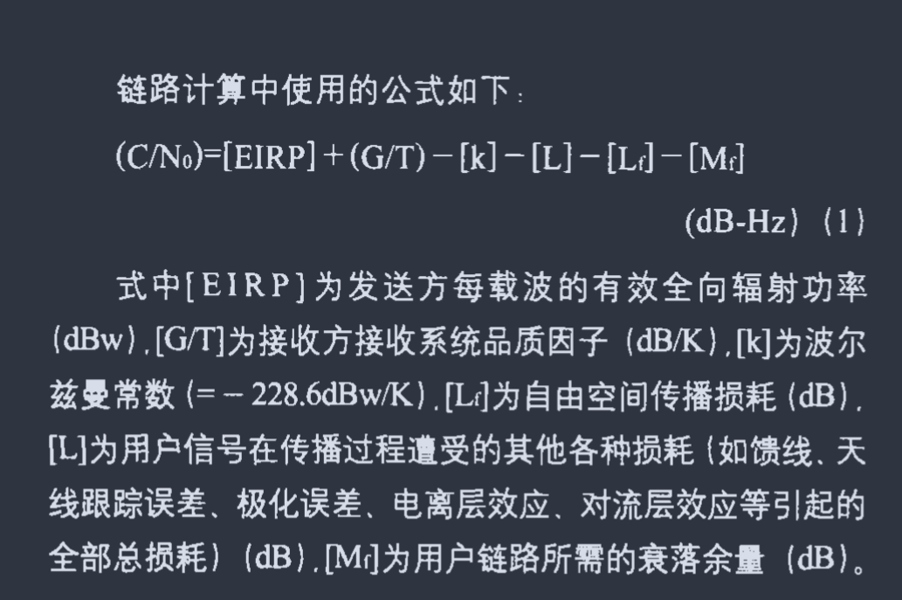
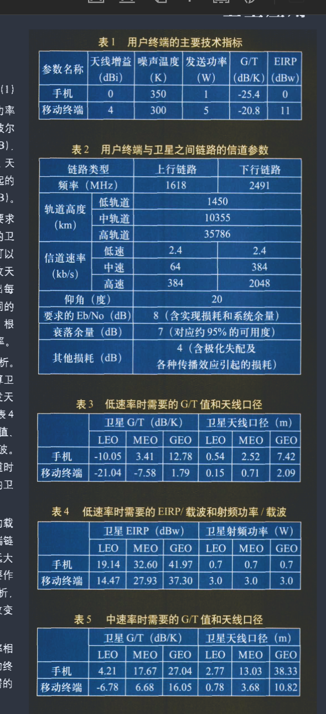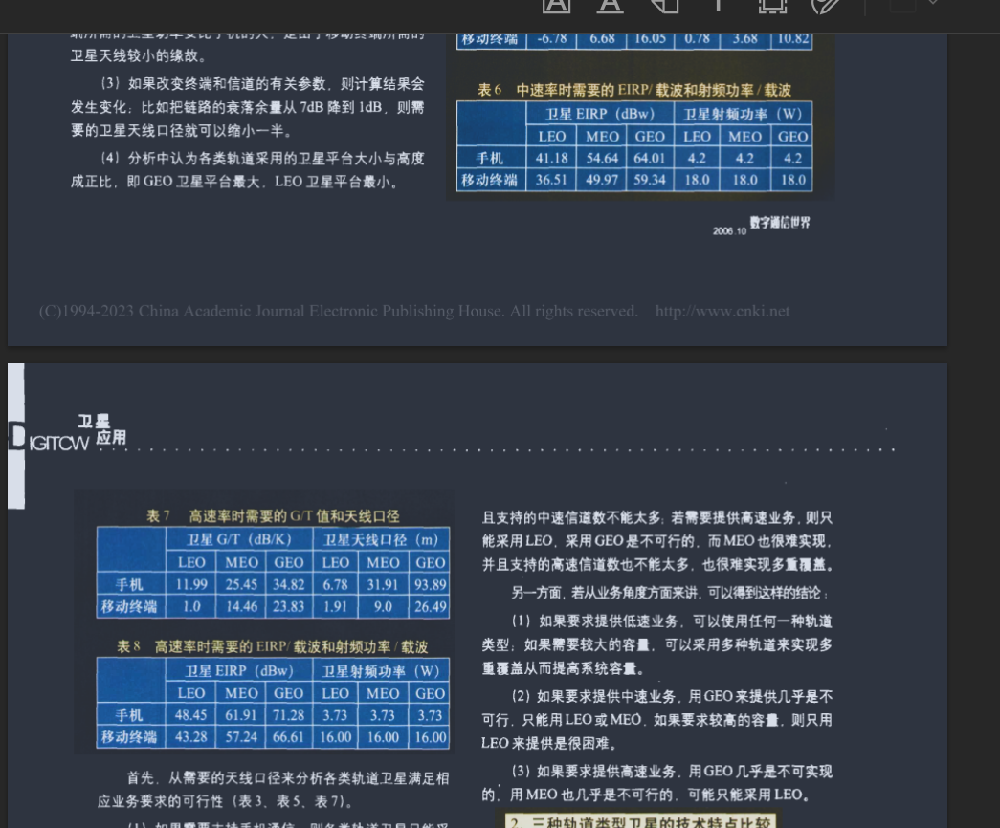

### 雨衰
雨衰是电波穿过降雨区域时，由雨滴吸收和散射引起的信号衰减现象。
雨衰的定义与机理
雨衰指电磁波在穿过降雨区域时，由于雨滴对电波的吸收和散射作用而导致的信号衰减 。其衰减主要包括两部分：

吸收衰减：雨滴作为介质吸收电波能量，表现为热损耗，是雨衰的主要成分 

散射衰减：电波在雨滴表面反射并发生二次散射，能量向各方向分散，导致原方向信号减弱 

**雨衰的强度与雨滴直径与电波波长的比值密切相关，当两者接近时会产生共振效应，衰减最明显**

雨粒的吸收衰减比散射衰减要大。 

工程应用与抗雨衰措施
在卫星通信和地面站设计中，雨衰是影响链路可靠性的重要因素 。常见的抗雨衰方法包括：  
信号不变恢复：通过波束分集、功率控制、位置分集、轨道分集等方式补偿衰减。  
信号改变恢复：调整载波频率、带宽、数据速率或编码方式，如自适应前向纠错（FEC）、自适应编码调制（ACM）等。  
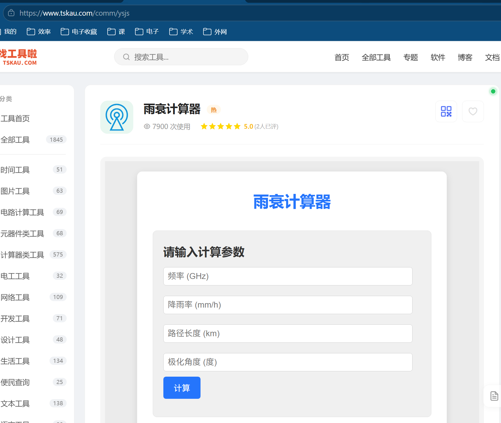
国移动的“四网协同”
这主要是一个历史概念，特指在3G/4G时代初期，中国移动为了平滑过渡，需要同时运营和维护的四张网络。这四张网分别是：

GSM：这是2G网络，主要承载基础的语音通话和短信业务。

TD-SCDMA：这是中国主导的3G技术，主要承载中速率的移动数据业务。

TD-LTE：这是4G网络，主要承载高速数据业务。

 #### 中国移动的“四网协同”
这主要是一个历史概念，特指在3G/4G时代初期，中国移动为了平滑过渡，需要同时运营和维护的四张网络。这四张网分别是：

GSM：这是2G网络，主要承载基础的语音通话和短信业务。

TD-SCDMA：这是中国主导的3G技术，主要承载中速率的移动数据业务。

TD-LTE：这是4G网络，主要承载高速数据业务。  
TD‑LTE 是 LTE 的 TDD（时分双工）版本，由中国移动等主导，属于 4G 国际标准之一，典型频段包括 1880–1920MHz、2300–2400MHz、2496–2690MHz 等，峰值下行速率可达约 100–130Mbps。

WLAN：也就是我们常说的Wi-Fi网络，作为蜂窝网络的补充，在热点地区提供大带宽、低成本的数据服务。

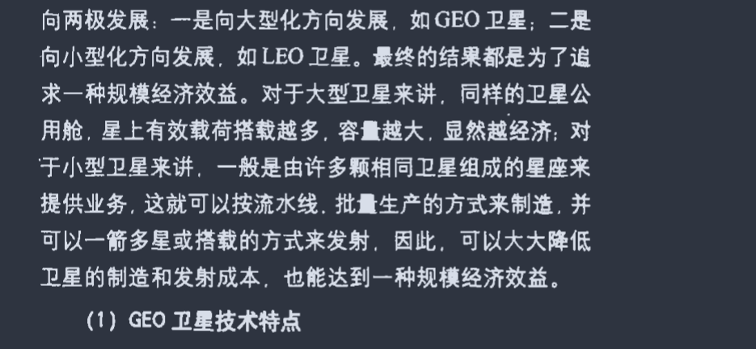
### 基于联合优化的高通量卫星跳波束图案设计研究
#### 高通量卫星（High Throughput Satellite, HTS）
，也称高吞吐量通信卫星，是卫星通信领域的一项重大技术革新。其核心优势在于，使用与传统通信卫星相同的频率资源，但能提供数倍乃至数十倍的数据吞吐量，通信容量可达数百Gbit/s甚至Tbit/s量级
多点波束 (Multi-spot Beam)：不再使用覆盖范围广但信号分散的单一宽波束，而是生成大量指向明确、覆盖范围小（通常300-700千米）的点波束。这如同将探照灯换成无数个聚光手电筒，能量更集中，信号更强。  
频率复用 (Frequency Reuse)：通过将服务区域分割成多个互不干扰的点波束，相同的频率资源可以在不同的波束中重复使用。这极大提高了单位频率资源的利用效率，是容量倍增的关键。  
更高的工作频段：传统卫星多使用C频段，而高通量卫星广泛采用Ku频段和Ka频段，并正向Q/V频段演进。更高频率意味着可用带宽更宽，能承载更多数据，其中Ka频段是目前的主流选择
#### Ka频段
Ka频段是电磁频谱中微波波段的一部分。

频率范围：26.5 - 40 GHz。

名称来源：“Ka”代表 “K-above”，意为“在K波段之上”。

别名：常被称为 30/20 GHz 波段，这对应了典型的卫星下行（约20GHz）和上行（约30GHz）频率。

👍 Ka频段的主要优势
带宽资源极其丰富：这是其最核心的优势。分配给卫星通信的可用带宽高达 3500 MHz，远超C和Ku频段（通常约500-800MHz），能支持千兆比特级的宽带传输。

终端设备小型化：由于频率高，在同等增益下，天线尺寸可以做得更小，有利于终端的小型化和便携化。

潜在干扰较少：作为较新的商业频段，其频谱资源相对不那么拥挤。

系统容量巨大：通过结合多点波束和频率复用技术，能实现数十倍甚至百倍于传统卫星的通信容量。例如，我国中星26号卫星的通信容量达百Gbps。

👎 Ka频段的主要挑战
雨衰效应显著：这是其最致命的缺点。高频信号在穿过雨层时衰减严重，会严重影响链路可靠性。

器件和工艺要求高：高频段对功率放大器等射频部件的性能要求极高。

受大气吸收影响：除了降雨，大气中的氧气和水蒸气也会吸收信号能量。

干扰问题复杂：其终端天线设计主要受制于抑制其他系统干扰的能力，而非天线增益本身。

波束覆盖范围小：高频段波束更窄，单个波束覆盖范围更小，对于覆盖动态性强的低轨星座（如论文研究场景），需要复杂的波束切换机制来保证服务连续性。

📡 主流卫星通信频段对比
频段	频率范围 (GHz)	典型上下行频率	主要业务与应用	优缺点
L波段	1 - 2	上行: 1.6 GHz
下行: 1.5 GHz	卫星移动通信 (MSS)
• 海事卫星电话 (Inmarsat)
• 铱星、全球星等低轨语音/窄带数据
• 卫星导航与定位 (GPS)	• 优点：穿透力强，抗雨衰能力极佳，适合移动和手持设备。
• 缺点：带宽极其有限，仅能支持窄带业务。

S波段	2 - 4	上行: 2.0 GHz
下行: 2.2 GHz	卫星移动通信 (MSS)
• 卫星数字音频广播
• 部分卫星电话和移动宽带
• 国际空间站通信	• 优点：穿透力较强，终端天线较小。
• 缺点：带宽资源有限，且与地面5G等业务存在竞争。

C波段	4 - 8	上行: 6 GHz
下行: 4 GHz	卫星固定业务 (FSS)
• 传统卫星电视广播
• 大型VSAT网络
• 重要的国际、国内通信骨干	• 优点：雨衰很小，链路非常稳定可靠。
• 缺点：天线口径较大（通常1.8米以上），且易受地面微波干扰。

X波段	8 - 12	上行: 8 GHz
下行: 7 GHz	卫星固定业务 (FSS)
• 军事卫星通信（核心应用）
• 政府与国防通信
• 气象、空中交通管制等	• 优点：抗干扰能力强，通信保密性好。
• 缺点：频段资源受限，主要供政府和军事用途。

Ku波段	12 - 18	上行: 14 GHz
下行: 11-12 GHz	卫星固定业务 (FSS) / 广播业务 (BSS)
• 卫星电视直播到户 (DTH)（如中星9号）
• 个人家用VSAT小站
• 移动应急通信、新闻采集 (SNG)	• 优点：天线尺寸小（0.3-0.6米），成本较低，便于个体接收。
• 缺点：雨衰较大，暴雨可能导致信号中断。

Ka波段	26 - 40	上行: 30 GHz
下行: 20 GHz	高通量卫星 (HTS) / 低轨星座 (LEO)
• 宽带互联网接入（Starlink, OneWeb等）
• 高清晰度电视 (HDTV) 传输
• 高速卫星新闻采集 (SNG)	• 优点：带宽极宽，容量巨大（可达Tbps级）。
• 缺点：雨衰最严重，对器件和工艺要求高。

#### 带宽
指的是频率资源的宽度。它直接决定了通信系统的容量上限和数据速率，是整个资源调度问题的核心物理量之一。
论文中的取值：根据论文表1，系统带宽为 self.bandwidth = 200e6，即 200 MHz。

由香农公式 
$C=B* log_2(1+SINR)$
#### 信干噪比（SINR,Signal-to-Interference-plus-Noise Ratio
有用信号的强度与有害信号（干扰 + 噪声）总强度

