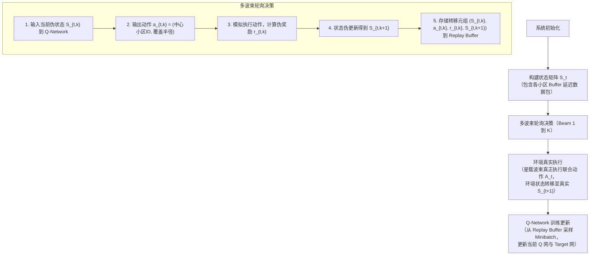
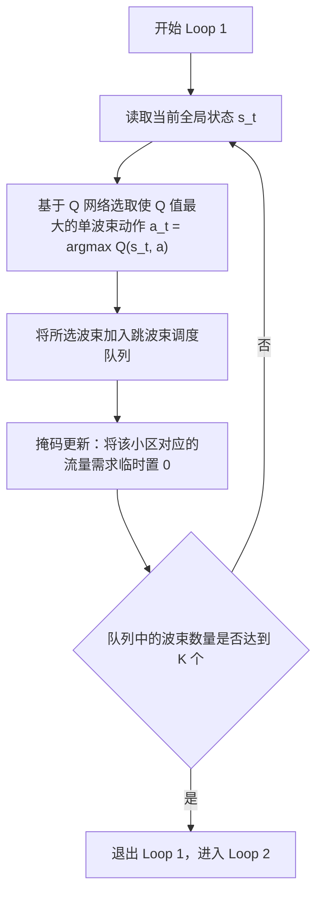

### [1]
    
 原文

广泛性
    
引文

    “With the continuous reduction of satellite launchcosts and the gradual maturity of satellite mass production, the low Earth orbit (LEO) satellite megaconstellations, which can provide seamless coverage,high data rate and low latency, become a hot spot for technological and commercial development and an indispensable component for 6G wireless coverage extension from land to the sea to achieve global three-dimensional seamless coverage ” 引文 段落2 时延低 
    “After 20 years of development, the satellite communication network has entered a new era. According
    to the more than 30 constellation plans that have been
    released worldwide, the satellite communication network shows the following three remarkable features:
    • The LEO satellite constellation has become ahot spot for current development [\19]. Iridium,OneWeb, SpaceX, Amazon and other commercial companies have implemented or announced their ambitious plans for LEO mobile satellite constellations [\12].
    • The large-scale development trend of LEO satellite constellations is significant. The number of LEO satellite constellations has changed fromsmall-scale constellations such as 48 (GlobalStar) and 60 (Iridium) to large-scale constellations such as 720 (OneWeb), 3236 (Kuiper), andmore than 12,000 (Starlink). The most representative constellation is the Starlink constellation,which currently has 1,890 satellites in orbit.
    • The service demands of users are becoming moreand more diversified. Specifically, the service demands of users have       expanded from traditional mobile communication services to broadband Internet services.”
    没有提到部署容易的地方 在此表明其成为热点 卫星发射多 服务要求复杂
或许部署容易是在：
因为量产了，成本低了所以部署容易了

论文在阐述低轨（LEO）巨型星座背景时引用了该文献。该文献证明了在未来6G移动通信中，巨型低轨卫星星座能够提供全球覆盖并应对非均匀业务需求。本文以此为背景，说明随着低轨星座规模的迅速膨胀，传统的静态资源分配方式无法满足时空分布极不均匀的地面业务需求，从而引出采用跳波束（Beam Hopping, BH）技术实现按需动态调度卫星资源的必然性和紧迫性 
### [2]

    
        "但多波束覆盖区内的不同波束内不同时间段的业务需求并不均匀,导致这种固定模式缺乏足够的灵活性,造成卫星的性能受限。" 引言1(下同 表示引言部分第一段) 
    
    原文:然而，由于业务需求在时空上的不均匀分布和动态变化，传统的多波束低轨卫星系统采用固定资源分配策略，这种方法缺乏灵活性，导致资源浪费 
### [3]
    原文"而跳波束技术采用时间分片技术，在同一时隙中只激活部分波束，从而并解决资源碎片化配置问题[3]，因此其被视为下一代低轨星座通信系统的关键技术。

    "A key requirement for the future multi-beam broadband satellite design is the provision of flexibility to adapt to different traffic demands by re-assigning capacity to beams in accordance with changing traffic distributions.Such flexibility would enable the best match to be maintained between the system resources and traffic demands over the satellite lifetime, thereby greatly enhancing the system utilisation and competitiveness" ABS1 显著提高卫星的资源利用率
    
    值得注意的是[3] 是"灵活的行波管（TWT）和多端口放大器来提供可变的每波束功率，以及使用模拟或数字处理器根据需求分配每波束带宽[1]。另一种可能具有明显优势的方法是使用波束跳跃技术，其中在任意时刻仅点亮部分波束. 这将导致一个具有预定义重复率或“窗口”长度的时间和空间传输计划[2]。"作为10年的文章 我们知道后面跳波束大获全胜(行波管则再没出现在我所查的论文中)

### [4]   
    原文：
    文献[4]和文献[5-6]分别使用遗传算法
    和启发式算法进行跳波束系统资源分配，以提高系
    统的吞吐量。
    由于需要优化的独立参数数量众多，可能解空间的维度很大，加上容量函数的高度非线性行为，选择了遗传算法（GAs）。
“
Given the large number of independent parameters to be optimized and the large dimension of the possible solution space, together with the highly non linear behavior of the capacity function, genetic algorithms (GAs) have been selected.

众所周知，遗传算法基于创建一个环境，在该环境中，可能解的群体竞争并进化直到最适应的个体生存。

As it is well known from literature, GAs are based on the creation of an environment where a population of possible solutions competes and evolves until the fittest individual survives.

在随后优化中，适应度函数被假设等于系统的总吞吐量T。

In the following optimizations, the fitness function has been assumed equal to the total system throughput T. Some fairness criteria could in general be introduced to shape the resulting available capacity profile: as an example, one may think of guaranteeing the provision of a certain ratio of the traffic demand per beam , or of a certain minimum constant throughput per beam.

通常可以引入一些公平性标准来塑造最终可用容量的分布：例如，可以考虑保证每个波束提供一定比例的交通需求，或每个波束提供一定的最小恒定吞吐量。

However, in the following, the simple capacity maximization has been assumed.
....
交叉算子。

Crossover operator.

在波束跳变计划上配置该算子有许多选项，但最有效的方法是（由于染色体的固有结构）在于在槽水平上重组所选择的父母，即，每对夫妇产生两个孩子，这是由祖细胞槽的均匀随机组合产生的。

Many options are available to configure this operator on the beam hopping plan but the most effective method (due to the inherent structure of the chromosome) consist on recombining the selected parents at slot level, i.e. every couple generate two children, resulting from the uniform random combination of the genitors’ slots.

在频率规划方面，考虑两种机制。

On the frequency plan’s side, two mechanisms are considered.

当跨越两个时隙时，对同时出现在两个时隙内的波束，将其载波做均匀重组；否则，载波分布替换为另一组随机生成的载波。

When crossing two slots, those beams appearing in both of them combine uniformly its carriers.

突变机制。

Otherwise, the carrier distribution is substituted by another randomly generated.

以类似的方式，必须从波束跳变计划和频率计划的角度考虑突变算子。

Mutation mechanism.

在波束计划上，突变包括在时隙中引入新的和非重复的波束，或者断开已经照射的波束之一。

In a similar way, the mutation operator must be considered from both the beam hopping plan and the frequency plan point of view.

在频率计划侧，该突变提供了波束平面的一个照射波束中的仅一个载波的变化。

On the Beam Plan, a mutation consists on the introduction of either a new and non-repeated beam in a time slot, or the disconnection of one of the beams already illuminated.

On the Frequency Plan side, the mutation provides a change in only one of the carriers in one of the illuminated beams of the Beam Plan.
"
这里用遗传算法
有五个步骤
(1) 初始化种群（Initialization）：随机生成一定数量的初始个体构成第一代种群。

(2)适应度评估（Fitness Evaluation）：计算种群中每个个体对应的目标函数值及适应度。

(3)选择（Selection）：根据适者生存原则，从当前种群中选择优良个体遗传到下一代（常用方法如轮盘赌选择、锦标赛选择）。

(4)交叉/杂交（Crossover）：以一定概率将两个父代个体的基因进行重组，生成新的子代个体，这是产生新解的主要方式。

(5)变异（Mutation）：以较小概率随机改变个体基因中的某些位，用以保持种群的多样性，防止算法过早陷入局部最优解（早熟

上述过程（评估 $\rightarrow$ 选择 $\rightarrow$ 交叉 $\rightarrow$ 变异）不断循环迭代，直到达到预设的终止条件（如达到最大迭代次数或解的适应度趋于稳定）

注:染色体/个体（Chromosome / Individual）：问题的潜在可行解，通常采用二进制编码、实数编码或符号编码表示。

种群（Population）：由多个个体组成的集合，代表搜索空间中的一组候选解。

适应度函数（Fitness Function）：用于评估个体优劣的标准，适应度值越高，说明该解越接近最优解A

### [5]
暂无数据 文章下不了 南邮没买

### [6]
作者针对传统跳波束（Beam Hopping, BH）资源分配算法只关注固定波束半径、向需求最大波位分配资源而忽视波束覆盖范围灵活性等问题，提出了一种基于业务分布动态调整波束尺寸（Beam Size）的启发式资源管理算法。
1. 算法核心思想
    传统跳波束系统中，单个波束的覆盖半径/照射面积通常是固定不变的。文献[6]引入了波束形状/覆盖范围的可变维度：
    
    当某一区域业务密度较高且分布分散时，通过放大波束覆盖尺寸，一次性覆盖更多波位/用户，从而提高用户的接入率并充分利用波束带宽。
    
    当业务相对集中时，通过缩小波束尺寸集中能量与资源服务重点区域
    算法的核心逻辑围绕业务分布感知、波束尺寸调整与时隙/带宽调度展开：

业务需求与优先级评估：

    收集各个波位/区域的实时业务需求（Traffic Demand）以及不同业务的服务质量（QoS）优先级（如时延敏感型或吞吐量敏感型业务）。
    
    动态波束尺寸调整（Beam Size Adjustment）：
    
    建立业务分布模型，根据各区域的业务密度与用户分布情况，启发式地计算最佳波束覆盖半径与照射位置。
    
    扩大波束半径以覆盖更多具有不均匀业务需求的邻接波位，降低未服务波位的等待概率。
    
    时隙与资源匹配调度：
    
    在动态波束覆盖的基础上，结合业务优先级进行时隙（Time Slot）和带宽资源的二次分配。
    
    优先保障高 QoS 优先级业务的传输要求，同时兼顾整体系统容量与丢包率。

自注:
    释义 :启发式资源管理算法，核心思想是在复杂、动态的环境中，不追求数学上的绝对最优解，而是用一套基于经验、规则或智能搜索的“启发式策略”，在可接受的时间和成本内，快速找到一个足够好的可行

    引自百度: 
    启发式算法（heuristic algorithm)是相对于最优化算法提出的。一个问题的最优算法求得该问题每个实例的最优解。启发式算法可以这样定义：一个基于直观或经验构造的算法，在可接受的花费（指计算时间和空间）下给出待解决组合优化问题每一个实例的一个可行解，该可行解与最优解的偏离程度一般不能被预计。现阶段，启发式算法以仿自然体算法为主，主要有蚁群算法、模拟退火法、神经网络等。

　举例

启发式算法家族庞大，主要包括以下几种类型：
    
    优先规则启发式 (Priority Rule-based Heuristics)：通过设定简单规则（如任务截止时间最早者优先）来快速决策。优点是简单、快速、易于实现，但解的质量依赖于规则的设计。
    
    元启发式算法 (Metaheuristics)：
        更高级的搜索策略，擅长全局搜索，避免陷入局部最优。常见的有：
    
    蚁群算法 (ACO)：
        模拟蚂蚁觅食，通过“信息素”和“启发式信息”共同作用寻找最优路径。
    
    粒子群算法 (PSO)：
        模拟鸟群觅食，通过个体与群体协作寻找最优解。
    
    遗传算法 (GA)：
        模拟生物进化，通过选择、交叉、变异等操作迭代优化。
    
    禁忌搜索 (TS)：
        通过禁忌表记录已搜索过的解，避免重复和陷入局部循环。
    
    超启发式算法 (Hyper-heuristics)：
        一种“管理启发式算法”的算法。它不直接解决问题，而是在更高层次上选择或组合不同的简单启发式算法，以实现更优的性能。
    
    特定领域启发式：
        针对特定问题设计的算法，例如结合经济学原理进行资源定价的算法，或基于嵌套分割法（Nested Partitions）的供应链资源分配算法。

### [7]
    原文:以降低系统业务时延为目标，
    文献[7]采用梯度理论推导出数据包排队时延的闭
    式解，有效减少了业务等待时间

由于跳频速率远低于分组到达速率的物理限制，理想的先来先服务分组调度是不可能实现的，这迫使我们转而追求最优的时隙调度
Due to the physical limitation that hopping speed is much slower than packet arrival speed, the ideal first-come-first-serve packet scheduling is not realizable, which compels us to pursuit the optimal slot scheduling instead.
为了处理复杂的随机规划问题，我们引入了分时原理来解耦变量，并采用随机梯度理论推导出了次优的封闭解。
To deal with the complex stochastic programming problem, we introduce the time-sharing principle to uncouple the variables and adopt stochastic gradient theory to deduce the suboptimal close-form solution.
ABS1

4.2 Optimization of visiting time duration
via stochastic gradient theory
According to the SGT [20], in order to obtain the long-term
optimization of the efficiency function fðÞ, we just need to
maximize its increment between two conjunct BHWs.根据SGT [20]，为了获得效率函数f的长期优化，我们只需要最大化两个合取BHW之间的增量

文章中为推导出次优的闭式解 为了方便理解 我这里类同于梯度优化部分 
梯度优化见《Python 与人工智能基础》2.1线性回归部分 简述当为设立预测值$\hat{y}$
设计奖励函数L 通过梯度下降求出L的最佳参数
过程类似 统概的最大似然估计 但是这里下降的步长是有要求的（学习率） 求出的是残差平方和的最小值

论文的次优闭式解：它是解析法（Analytical）。论文利用梯度算出目标函数的增量后，并没有像下山一样一步步往下走，而是直接令拉格朗日函数的导数为 0（见公式16），然后通过数学放缩（定理1和引理1）硬解出了一个显性的代数公式（公式20）
只要把当前的流量、速率代入，一步就能算出结果，不需要循环迭代。

引文：
    拉格朗日乘子法。 Lagrange multiplier method
[拉格朗日乘子法](obsidian://open?vault=%E8%8B%8F&file=%E5%BA%937.27%2F%E6%8B%89%E6%A0%BC%E6%9C%97%E6%97%A5%E4%B9%98%E5%AD%90%E6%B3%95)
我们引入一个拉格朗日乘子B来约束表达式，得到拉格朗日量如下。
we introduce a Lagrange multiplier b to combine the constrained expression, obtaining the Lagrangian as follows
### -=【7】未看完 稍后继续

### [8]
    文献[8]通过将
    波束位置划分问题转化为p-center问题，实现了用
    最少的波束位置覆盖所有用户，从而降低数据排队
    时延。

可以看到原文还是借鉴了引文[8]的这方面 又或许这是常识

此时注意 min{} 和min() 和 min  是不同的
前两者是取后面的范围中的最小值和几个数中的最小值
后一个可以视作动词用  $ min f(x) $或是 $ min_x f(x) $
表示求解使目标函数 f(x)取得最小值的自变量x。

p-Center 问题定义：运筹学中的经典设施选址问题，旨在区域内挑选 $p$ 
个服务中心（即波束中心），使得所有被服务点（地面用户/业务点）
到其最近服务中心的最大距离最小（或在满足覆盖要求的条件下使中心数量 $p$ 最小）
Tang 等 - 2021 - [8]Optimization Method of Dynami
c Beam Position for LEO Beam-Hopping Satellite Communi
cation Systems.pdf]。

实体映射：需求点：地面实际存在通信需求的活跃用户或小区节点服务中心：跳
波束卫星在足迹区域内动态生成的波束照射中心
优化目标：根据实时用户分布与业务流量分布，以最少数量的波位
（最小化 $p$ 值）实现对当前所有活跃业务的完整覆盖

步骤1 随机取得三个点为服务中心
步骤2 最小化距离 
步骤3 重排 思考是否有更优center点

### [9]
    文献[9]提出一
    种以最大化吞吐量为目标的深度强化学习算法，用
    于优化跳波束系统容量。
提出了一种基于深度强化学习的联合优化算法，对跳束调度和覆盖控制进行联合优化（称为DeepBeam），它灵活地使用了时间、空间和波束覆盖半径三个自由度，此外，为了降低计算复杂度和加速DeepBeam的训练，我们首先为波束之一训练单个模型，然后以轮询方式为每个波束使用该训练模型来确定要被照射的小区和波束覆盖。

单模型复用与轮询机制（Polling Manner）：训练时，将单个“波束”作为独立智能体（Agent）训练出单一模型。  应用时，卫星上的多个波束以轮询（Round-robin）的方式共享并调用这同一个模型来做出调度策略。
这大幅降低了动作空间和计算复杂度。

状态伪更新技术（Pseudo-updates）：
在同一时隙内，轮询各个波束做决策时，算法会对环境状态进行伪更新
（假定前面已决策波束执行了动作并更新了状态）。
这能防止多个波束在同一时刻输出完全相同地重复策略

网络结构与训练 (Deep Q-Network)：
CNN 骨干：利用卷积神经网络（CNN）来提取小区通信需求分布的空间结构特征。  
双网络与经验回放：采用目标网络（Target Network）
与策略网络（Policy Network）的双网络架构减少 Q 值过估计，并引入经验回放池（Replay Buffer）提高训练稳定性。

    
[马尔可夫决策过程 (MDP)](obsidian://open?vault=%E8%8B%8F&file=%E5%BA%937.27%2F%E9%A9%AC%E5%B0%94%E5%8F%AF%E5%A4%AB%E5%86%B3%E7%AD%96%E8%BF%87%E7%A8%8B%EF%BC%88Markov%20Decision%20Process%2C%20MDP%EF%BC%89)
构建：

状态空间 ($S_t$)：由卫星缓冲区（Buffer）中记录的各小区在最大可忍受排队延迟内的待服务数据包需求矩阵构成。  

动作空间 ($a_k$)：动作是二维的，包含
波束照射的目标中心小区 ID（$n_t$）以及
波束的覆盖半径（$\chi_t^k$）。  

奖励函数 ($r$)：定义为系统在当前时隙内实际成功传输的数据包总量（ 即系统实时吞吐量）

**可以看到** 这里和**原文2.2** 说明是一个马尔可夫过程 
在之后的算法1部分是有体现的
下面是MDP(马尔可夫决策过程)
#### 1. MDP 的核心五元组
一个标准的MDP通常由以下五个元素定义（记作 \( (S, A, P, R, \gamma) \)）：

- **状态空间（\( S \)）**：环境在某一时刻的所有可能情形。例如，在围棋中，状态就是当前棋盘上所有棋子的布局。
- **动作空间（\( A \)）**：智能体在某个状态下可以采取的所有操作。例如，机器人可以选择“向左转”或“向前走”。
- **状态转移概率（\( P \)）**：核心动力学函数，记作 \( P(s' | s, a) \)。它表示智能体在状态 \( s \) 执行动作 \( a \) 后，环境转移到下一个状态 \( s' \) 的概率。
- **奖励函数（\( R \)）**：记作 \( R(s, a) \) 或 \( R(s, a, s') \)。它定义了智能体在状态 \( s \) 执行动作 \( a \) 后，环境即时反馈给智能体的数值信号。奖励是智能体优化目标的唯一依据。
- **折扣因子（ $\gamma$ in [0, 1] ）**：用于平衡**即时奖励**和**未来奖励**的权重。\( \gamma \) 越接近 0，智能体越“短视”；越接近 1，智能体越“有远见”。
#### 注意 核心假设在马尔可夫性 即非时效性
[<a href="#自定义名称-编号">马与非时效性的区分</a>]

 
卫星拥有 K个发射波束，如果让算法同时为 K个波束做决策，
动作组合数将呈现组合爆炸（复杂度为 $C_N^K \times K^D$ )。  
DeepBeam 的解决思路是：
不在同一时间点“并行”决策所有波束，而是在单时隙内部“串行轮询”每一个波束 

**轮询机制（Polling Manner)** 是降维与实现模型高度复用的核心设计  
从底层数据结构看，轮询的本质是一个环形队列（Circular Queue）。 
维护一个当前索引指针 index，每次分配时取 array[index]，然后执行 index = (index + 1) % N（N为总数）。 
这种实现保证了分配周期的确定性和 O(1) 的时间复杂度。

在多波束卫星系统中，如果直接用卫星作为单一 Agent 去同时决策 $K$ 个波束的“照射小区”和“覆盖半径”，
动作空间会发生爆炸（高达 $C_N^K \times K^D$）。  
为了降维，DeepBeam 算法选择只训练一个“波束” Agent，
让 $K$ 个波束以轮询（Polling）的方式复用这个模型。  
但是这会带来一个新问题：
如果第 1 到第 $K$ 个波束在同一时隙决策时，
看到的环境状态（系统容量/ Buffer 数据包）是完全相同的快照，
那么这个复用的模型就会为所有波束输出一模一样的动作
（例如所有波束都挤去照射同一个需求最大的小区）。
状态伪更新的工作原理为了避免“所有波束做出重复决策”，
    DeepBeam 引入了时序上的串行伪更新：  

        真实状态 S_t ──► [波束 1 决策 a_{t,1}] ──► 伪更新 ──► 伪状态 S_{t,2} ──► [波束 2 决策 a_{t,2}] ──► ...
                                                                                                    │
                                                                                                    ▼
        [真实环境执行联合动作 A_t] ◄───────────────────────────────────────────── 伪状态 S_{t,K+1}
第 1 个波束决策：输入初始真实状态 $S_{t,1} = S_t$，输出动作 $a_{t,1}$。  
模拟传输与伪更新：假设波束 1 已经执行了 $a_{t,1}$ 并完成了数据传输，算法在内存中预先扣除波束 1 所覆盖小区簇中已被服务的数据包，生成一个伪状态（Pseudo-state） $S_{t,2}$。  第 2 个波束决策：波束 2 输入伪状态 $S_{t,2}$。
由于刚才波束 1 覆盖区域的需求已经被“伪清空”或减少，
模型自然会倾向于选择其他有需求的小区，输出差异化的动作 $a_{t,2}$。 
循环至第 $K$ 个波束：重复上述过程，直到所有 $K$ 个波束完成决策。  
打包执行： 最终将生成的联合动作向量 $A_t = (a_{t,1}, a_{t,2}, \dots, a_{t,K})$ 一次性下发给卫星环境真正执行。  

**双网络架构 (Dual Network Technique)**
为什么引入？在标准的 Q-learning 中，更新目标值时使用了相同的 Q 网络来同时选择动作和评估动作价值：$$y_t = r_t + \gamma \max_{a'} Q(s_{t+1}, a'; \theta)$$
这会导致正向误差累积，产生严重的 Q 值过度高估（Overestimation），
使得训练过程容易发散。 
### L未理解
如何实现？DeepBeam 维护了两个结构相同但参数更新频率不同的神经网络： 
   
    [当前伪状态 S_{t,k+1}]
                    │
                    ▼
    ┌─────────────────────────────────┐
    │     目标网络 (Target Network)    │ ───► 计算目标值 y_t = r + γ * max Q^-(S_{t,k+1}, a'; θ^-)
    │           参数: θ^-             │
    └─────────────────────────────────┘
                    ▲
                    │ 每隔 G 步同步一次参数 (θ^- ◄─ θ)
    ┌─────────────────────────────────┐
    │     策略网络 (Policy Network)    │ ───► 计算当前估计值 Q(S_{t,k}, a_{t,k}; θ)
    │            参数: θ              │      并通过 L(θ) 梯度下降更新 θ
    └─────────────────────────────────┘
   
**策略网络（Policy Network / Q-Network，参数 $\theta$）**：
用于评估当前状态下的动作价值 $Q(s, a; \theta)$，
并根据 $\epsilon$-greedy 策略选择动作。  
在每个训练步中，通过梯度下降实时更新参数 $\theta$。 
参数 $\theta$ 指的是策略 Q 网络（Policy Network / Q-Network）中所有可学习的权重（Weights）和偏置（Biases）参数集合

###### 目标网络

（Target Network，参数 $\theta^-$）：
专门用于计算 Bellman 方程中的目标值（Target Value）：
     $$y_t = r_{t,k} + \gamma \cdot \max_{a'} Q^-\left(s_{t,k+1}, a'; \theta^-\right)$$参数 $\theta^-$ 
在训练过程中保持冻结，每隔固定步数 $G$ 步才将策略网络的参数复制过来（$\theta^- \leftarrow \theta$）。  

作用：
通过切断“用同一套参数评估自身”的直接反馈循环，
极大地缓解了 Q 值高估问题，保证了训练目标的平稳性。

###### 经验回放技术 (Experience Replay Buffer)
为什么引入？强化学习中的连续样本（如 $s_t, a_t, r_t, s_{t+1}$）
在时间上具有极强的相关性（Temporal Correlation）。如果直接用这种连续样本训练神经网络，不仅违反了机器学习中数据需“独立同分布（i.i.d.）”
的前提，还极易导致网络产生过度拟合或训练震荡。  

如何实现？

经验存储（Storage）：在多波束轮询决策和伪更新过程中，每个波束产生的伪转移元组 $(s_{t,k}, a_{t,k}, r_{t,k}, s_{t,k+1})$ 
都会被存入一个容量固定的经验回放池（Replay Buffer, $\mathcal{D}$）中。 

随机采样（Minibatch Sampling）：在训练阶段，算法不直接使用最新产生的数据，而是从 $\mathcal{D}$ 中随机均匀采样一个 Mini-batch（小批量数据，大小为 $B$）。  损失计算与更新：利用采样的批量数据计算均方误差损失（MSE Loss）：
  $$L_t(\theta_t) = \mathbb{E}_{(s,a,r,s') \sim U(\mathcal{D})} \left[ \left( y_t - Q(s, a; \theta_t) \right)^2 \right]$$通过反向传播更新策略网络参数 $\theta$。  作用：打乱样本相关性：随机采样破坏了时序数据之间的相关性，使训练过程更加稳定。  提高数据利用率：一条经验元组可以被多次重复采样用于训练，大幅提升了样本效率。

### [10]

    文献[10-11]建立了最小化
    排队时延模型，并利用深度强化学习方法对波束进
    行灵活分配，从而降低数据传输时延。
在多波束卫星通信系统中，波束跳变（BH）是提高系统吞吐量和降低传输时延的关键技术，本文研究了一种最大化系统长期资源利用率的策略，并给出了BH照射方案（BHIP）本文提出了一个以最小化传输时延为目标的最优化问题，并将其描述为一个部分可观测的马尔可夫决策过程针对多波束卫星系统中的BHIP问题，首次提出了一种基于人工智能的深度强化学习（Deep Reinforcement Learning，DRL）算法，该算法综合考虑了业务需求的空间分布仿真结果表明，本文提出的DRL算法能够较好地抑制DRL中的多径干扰，并能有效地抑制DRL中的多径干扰.与现有算法相比，BHIP算法在降低传输时延的同时，进一步提升了系统的吞吐量。

[10]的第一个公式组 可见和原文（9）(14)(15)(16)异曲同工
对应“最小化排队时延模型”
至于深度学习部分似乎也是马尔可夫决策 似乎大同小异

注 这里的$\theta$也是在双网络架构中的 [双网络中的$\theta$](#目标网络)

### [11]

    文献[10-11]建立了最小化
    排队时延模型，并利用深度强化学习方法对波束进
    行灵活分配，从而降低数据传输时延。

same to 10.0

### [12] 插眼需时间深读
    此外，综合
    考虑多目标优化问题，文献[12]提出一种用于波束管
    理和资源配置协作的深度强化学习方案。
ABS:基于低轨卫星的非地面网络（NTN）是支持全球普适无线业务的有效手段，由于低轨卫星的快速移动性，特定用户设备（UE）经常会发生波束/卫星间切换，为了解决这一问题，人们研究了地面固定小区场景，其中LEO卫星在其驻留时间内将其波束方向调整到固定区域，以保持UE稳定的传输性能，因此，要求LEO卫星进行实时的资源分配，为了解决这个问题，本文提出了一种用于NTN中波束管理和资源分配的双时间尺度协同深度强化学习（DRL）方案，其中，具有不同控制周期的LEO卫星和UE通过顺序的方式更新其决策策略，具体地，UE在改进两个代理的价值函数的情况下更新其策略。 
此外，仿真结果表明，与传统的贪婪搜索算法相比，该算法能够有效地平衡吞吐量性能和计算复杂度 
索引术语-非地面网络（NTN），地球固定小区，资源分配，深度强化学习（DRL），多时间尺度马尔可夫决策过程（MMDPs）

#### 双时间尺度（Two-Time-Scale）建模
将原本高维的联合优化问题解耦，分化为两个不同时间尺度的马尔可夫决策过程（MDP）： 
高层 Agent（LEO 卫星 / 大时间尺度）：控制周期较长（如数百毫秒级），负责更新发波束方向与候选资源块集合。

底层 Agent（地面 UE / 小时间尺度）：控制周期较短（毫秒级，逐时隙更新），利用地面算力更强的优势，负责实时调整接收波束方向与资源块的具体接入。

#### 协作式策略更新与价值函数优化
为解决双 Agent 间的决策冲突与算力分配问题，采用了串行策略更新（Sequential Policy Updating）机制： 
UE 侧优先更新：地面 UE 采用 TRPO（信赖域策略优化） 算法更新策略，且在更新时综合考虑了 UE 和 LEO 两个 Agent 的联合优势估计（Sum Advantage Estimation），确保策略朝着提升双方整体价值的方向改进。 
决策轨迹传递：UE 根据更新后的策略预测未来的动作序列，生成参考决策轨迹（Reference Decision Trajectory）发送给卫星。 
卫星侧有限步展开（Rollout）：LEO 卫星接收到 UE 的参考轨迹后，利用 DNN 估算尾部价值（Tail Value），仅需执行有限步展开策略（Finite-Step Rollouts）即可完成策略更新，极大减轻了卫星端的计算负担。

### [13]
    文献[13]通
    过改进的多目标优化深度强化学习（DRL-MOP,
    deep reinforcement learning multi-objective optimiza‐
    tion）算法显著提升了系统性能。
南邮没有买【13】

### [14]
    文献[14]针对基
    于DVB-S2X标准的跳波束卫星，提出一种无模型
    多目标深度强化学习方法，结合双环学习（DLL,
    double-loop learning）的多动作选择策略，能够根
    据用户需求和信道条件动态分配资源。
#### 双环学习（DLL, double-loop learning）
Loop 1（内环——时分单波束选择）
 步骤 1.1：Agent 感知当前的系统状态 $s_t$。 
 步骤 1.2：选择一个使当前 Q 值最大的单个波束（即单个小区）。 步骤 1.3：将该选中的波束放入波束调度队列中。
 步骤 1.4：更新临时状态——在状态矩阵中将该已选小区当前的时延和业务需求临时清零（Masking），防止重复选择。 
步骤 1.5：重复上述过程，直到调度队列中累计选满了 $K$ 个波束。此时内环结束，切换至 Loop 2。 

Loop 2（外环——组合动作执行与网络更新）：  
步骤 2.1：将 Loop 1 选出的 $K$ 个单波束打包作为在 $t$ 时隙执行的联合跳波束动作 $a_t$。
   步骤 2.2：卫星环境执行动作 $a_t$，反馈多目标合成奖励 $r_t$（包含实时业务时延 $r_{1t}$、非实时业务吞吐量 $r_{2t}$ 及公平性 $r_{3t}$）以及更新后的系统状态 $s_{t+1}$。 
  步骤 2.3：将经验样本 $(s_t, a_t, r_t, s_{t+1})$ 存储到经验回放池（Replay Memory）中。
   步骤 2.4：从经验池中抽取 Mini-batch 样本，采用 Adam 优化器训练并更新 DQN 的神经网络参数 $\theta$。
 步骤 2.5：完成更新后，系统推进至下一个时隙，重新切换回 Loop 1。

    +-------------------------------------------------------------------------------+
    | Loop 1: 单波束串行选择 (内环)                                                  |
    | 1. 读取当前全局状态 s_t                                                        |
    | 2. 基于 Q 网络选取使 Q 值最大的单波束动作 a_t = argmax Q(s_t, a)              |
    | 3. 将所选波束加入跳波束调度队列                                               |
    | 4. 掩码更新：将该小区对应的流量需求临时置 0                                     |
    | 5. 重复 1~4，直到队列中的波束数量达到 K 个                                     |
    +-------------------------------------------------------------------------------+
                                          │
                                          ▼ (凑齐 K 个波束)
    +-------------------------------------------------------------------------------+
    | Loop 2: 组合动作执行与强化学习更新 (外环)                                     |
    | 1. 将 Loop 1 中选出的 K 个波束合成为当前时隙的最终组合动作 a_t                 |
    | 2. 卫星执行动作 a_t，与环境交互得到多目标标量化奖励 r_t 及下一时刻状态 s_{t+1}  |
    | 3. 将四元组 (s_t, a_t, r_t, s_{t+1}) 存入经验回放池 (Memory Pool)               |
    | 4. 从经验池中随机采样 Mini-batch 数据，训练并更新 DQN 网络参数                |
    +-------------------------------------------------------------------------------+
                                          │
                                          ▼ (进入下一时隙)
                                 返回 Loop 1 继续执行

效果总结：通过 DLL 机制，原本需要从 $C_{37}^{10} \approx 3.48 \times 10^8$ 个组合中盲目搜索的问题，
被简化为了 $K=10$ 次单波束选择。这种方式显著降低了动作探索空间，
使得网络能够在较少训练轮次（Epochs）内快速收敛，并大幅降低平均传输时延。

##### 思考 无模型在哪里 不理解
在强化学习（RL）中，“模型（Model）”有着非常严格和具体的定义：它专指“环境的状态转移概率 $P(s'\vert{}s, a)$” 和 “奖励函数 $R(s, a)$ 的解析分布”

 有模型（Model-Based）：Agent 在做出动作之前，内部手里有一张“环境地图”或者“精准计算器”。
它在心中推演：“如果我在状态 $s$ 选择了动作 $a$，根据公式，我有 100% 的把握预测出下一个状态一定会变成 $s'$，且能拿到多少奖励。”
 无模型（Model-Free）：Agent 事先对环境的演变规律一无所知。它不知道做完动作后环境会变成什么样，它唯一的学习方式就是“亲自试错（Trial-and-Error）”——做了动作 $a$ 之后，看环境反馈给它什么状态 $s'$ 和奖励 $r$，然后记录下来更新自己的经验。

二、 论文中的“无模型”具体体现在哪里？在这篇卫星资源调度论文中，“无模型”主要体现在以下两个核心点：
1. 未知且不可预测的“地面业务到达与时延动态”虽然论文里写出了缓存区队列更新的代数公式（如 $Q_{t+1} = \max(0, Q_t + D_t - C_t)$），
但真实世界中的用户数据包到达率 $D_t$ 是完全随机且动态变化的（比如突发流量、网络拥塞等）。
如果有模型（Model-Based）：算法需要提前精准预测未来每个时刻每个小区会有多少数据包到达（即要求知道 $D_t$ 的精确概率分布 $P(D_t)$），以此在数学上推导出最佳调度解。
无模型（Model-Free）：DQN 算法根本不需要知道未来的流量到达分布。它只是在时刻 $t$ 看看缓存区里“现在有多少包”，随便试着给它分个波束，观察下一时刻 $t+1$ 缓存是积压了还是清空了。它是在不预测未来的情况下，通过试错学习到了某种“看到这种积压就该分波束”的直觉策略。

### [15]
    文献[15]将
    每颗低轨卫星视为一个智能体，在星地协同的场景
    下，通过多星多智能体深度强化学习进行跳波束资
    源智能调度。
ABS：
摘要：采用跳波束技术的非静止轨道（NGSO）星座具有覆盖范围广、频谱利用率高等特点，如何有效调度多星波束资源以满足异构、不均匀的地面业务需求，是卫星运营商面临的一个巨大挑战.其中复杂的多卫星BH问题被公式化为长期和短期子问题。 
**长期子问题**是小区-卫星关联问题，该问题由网络运行控制中心（NOCC）执行一个低复杂度的迭代算法来解决，以最小化卫星间的业务负载差距，同时考虑干扰避免。 
**短期子问题**是多卫星业务驱动的BH问题，我们提出了一个多智能体深度强化学习（MADRL）架构，每个卫星可以协作使真实的-仿真结果表明，与非负载均衡方案相比，该方案的负载间隙和网络延迟分别减少了70%和50%。 
该算法在各种业务负载情况下的网络吞吐量方面优于其他基准，此外，所提出的QMIX-BH可以应用于实时调度，因为执行时间小于1 ms。

对于长期子问题，在网络控制中心（NOCC）执行，根据地面长期的业务统计信息（如业务到达率），决定小区业务流向哪颗卫星。
 短期子问题:
 问题:各卫星根据实时队列状态（包含实时业务 RT 和非实时业务 NRT 的队列长度及时延）与信道状态，逐时隙（Slot-by-slot）决策波束照射位置
 方法：
     POMDP 建模：将每颗卫星看作一个 Agent，建模为部分可观测马尔可夫决策过程。
     [QMIX 算法](#qmixq-value-mixing)

    +-------------------------------------------------------------------------------+
    |                           【阶段一：长期宏观调控】                              |
    |                    网络控制中心 (NOCC) - 基于长时间尺度业务                    |
    +-------------------------------------------------------------------------------+
                                            │
                                            ▼
                      +-------------------------------------------+
                      |  1. 预分配阶段 (Greedy Initial Search)    |
                      |  - 按业务需求降序排列小区                  |
                      |  - 优先分配给负载最小的可见卫星            |
                      +-------------------------------------------+
                                            │
                                            ▼
                      +-------------------------------------------+
                      |  2. 迭代调整阶段 (Interference-Aware)     |
                      |  - 检查星间干扰约束                        |
                      |  - 逐步转移/共享小区，缩小星间负载差距      |
                      +-------------------------------------------+
                                            │
                                            ▼
                               得到【小区-卫星关联映射表】
                                            │
                                            │ (下发关联策略)
                                            ▼
    +-------------------------------------------------------------------------------+
    |                           【阶段二：短期微观执行】                              |
    |                 卫星 Agent - 基于 Slot-by-Slot 实时状态 (MADRL)               |
    +-------------------------------------------------------------------------------+
        │
        ├─►【离线/集中式训练 (CTDE)】
        │     1. 结合空间隔离（Spatial Isolation）约束生成离散动作空间
        │     2. 所有 Agent 共享参数（Parameter Sharing），结合 GRU 处理时序队列
        │     3. 中央节点利用全局状态（队列长度+信道+时延）训练 Mixing Network
        │
        └─►【在线/分布式推理 (推理耗时 < 1ms)】
              1. 各卫星仅观测本地状态（RT/NRT 队列长度、信道 Gain）
              2. 本地 Agent Network 输出当前时隙的最佳跳波束图案 (BH Pattern)
              3. 逐时隙 (Slot-by-slot) 完成业务发射与队列更新

这里可以看到与算法的优劣对比的对照组的一般选项
随机、周期、队列长度优先、队列时延优先、最大[用户服务权重增益](#用户服务权重增益)
与原文中的随机 遗传算法 延迟 吞吐量 互相一同给出些许思路吧

##### QMIX(Q-value Mixing)
是多智能体强化学习（MARL）领域一个非常经典的算法 
 核心思想：“集中训练，分散执行”（CTDE）
其实就是给各个Q网络的Q值结果赋权重
（AI大人说了 混合网络（Mixing Network）输入的不是“奖励（Reward）”，而是各个智能体网络输出的 动作价值（Q值，即 Action-Value） 
为什么要区分？ 奖励（R）是环境给的即时单步反馈，而 Q 值是智能体对未来长期累积回报（Return）的预估。QMIX 混合的是“预估的总价值”，而非“眼前的甜头”。如果只混合即时奖励，智能体就会变得“短视”，丧失规划能力。 ）

权重 w 是由一个超网络（Hypernetwork）根据当前的全局状态（Global State）实时计算出来的。也就是说，在不同的环境局势下，各个智能体的“话语权”是动态变化的

##### 用户服务权重增益
即通过为不同用户或业务分配“权重（Weight）”，来动态调整资源分配比例，从而实现差异化的QoS保障
 权重（Weight）代表优先级：高权重意味着用户有更小的延迟容忍度或更高的资源期望 
“增益（Gain）”代表动态优化：这里的“增益”不是指权重值本身，
而是指通过动态、智能地调整权重分配，为系统带来的性能提升或效用增加

### [16]
    跳波束技术采用时间分片原理进行大时空尺度
    上的资源调度，其中卫星上的功率、带宽等资源以
    跳波束时隙为颗粒度分配给各波束，并且各波束可
    共享星上的无线资源[16]
南邮没有买[16]

### [17]

南邮没有买[17]

### [18]
    综上所述，通过式(1)建立了跳波束服务卫星与服务
    区域随时间变化的映射关系[18-19]
154页 NB 
    AI 大人帮我定位

3.1 二段二句 
本文根据LEO卫星通信
的特点，<u>在最短距离策略、最长服务时间策略和负载均衡策略的基础上</u>,既保留
最长服务时间策略的优点，又避免较低仰角带来的信道恶化,同时还要尽量使空
间的通信业务量趋于均衡，避免呼叫繁忙的部分卫星过载

论文内页码22

论文内页码14 
通过仿真，分别对 “ 最短路径优先” 和 “ 最长覆盖时间”
两种算法下快速终端的切换时延情况进行统计和比较，得到了有一定参考价值的
结果。文献[91]从切换的角度考虑，针对两种不同用户终端及非均匀的业务分布，
提出一种带优先级的信道预留策略。
#### 注 高低得好好读读

### [19]
    综上所述，通过式(1)建立了跳波束服务卫星与服务
    区域随时间变化的映射关系[18-19]

### [20]

我没找到！？？ 我没找到！？？
我实在是想不通一个 基于改进LSTM算法的6页文章中为什么会有关于影响干扰功率I的friss 传输方程

### [21]

sidelobes 旁瓣 此处指边上的波束

### [22]

ABS：本文提出了利用Ermakov-Lewis不变量计算第一类复度Legendre函数及其关联Legendre函数的公式。
这些公式在数值实现上较为直接，其动机来自于标准大学工具（如MatLab和Maple）中缺乏相关计算程序。
还得到了沿相反方向传播的角波。
这些结果在复角动量理论以及从中心势中进行自旋依赖角散射的近侧/远侧分析中 具有特别重要的应用价值。

[Legendre函数](obsidian://open?vault=%E8%8B%8F&file=%E5%BA%937.27%2F%E5%8B%92%E8%AE%A9%E5%BE%B7%E5%87%BD%E6%95%B0%EF%BC%88Legendre%20Functions%EF%BC%89)
这里勒让德函数是对球面解的在求解三维波动方程（如薛定谔方程、亥姆霍兹方程）时：

球坐标分离变量：径向解是球贝塞尔函数  $\psi(r,θ)=j_l(kr) P_l(cosθ)$
 球坐标分离变量：径向解是球贝塞尔函数$j_l(kr)$，角向解P_l(cosθ)是勒让德函数
两者的乘积构成最基础的球面波解：

### [23]
南邮没续费万方
### [24]

此处为香农公式
这是作者早期的文章 
可见

#### 信噪比和信干噪比的区别

SNR（信噪比）：$$
SNR=   \frac {P_{signal}}{P_{noise}}$$
分母只有热噪声（由电子热运动引起的固有白噪声，无法彻底消除）。

SINR（信干噪比）：$$
SINR=   \frac {P_{signal}} {P_{noise}+P_{inference} }$$
分母不仅有热噪声，还叠加了外部干扰（如同频干扰、邻道干扰、多径干扰等）。

SNR 常用于有线通信（如光纤、网线）或点对点视距无线传输（如卫星下行链路）。在这些场景中，信道是“干净”的，主要敌人是器件内部的热噪声。

SINR 常用于蜂窝移动通信（如4G/5G/Wi-Fi）。
在现代组网中，干扰（尤其是同频干扰）往往比热噪声大几十倍，SINR更能真实反映用户体验。
这也是为什么5G引入了波束成形和干扰抑制技术——目的就是为了提升SINR。

其他引证参见[28中关于SINR描述](#28sinr)

由于是同作者的前一篇 可见基本思路是相同的 除了主体的算法创新外 可以算基础是相同的
为了进一步跟踪 我希望追踪
[24]中的 
［１４］ 张晨，张更新，王显煜．基于跳波束的新一代高通量卫
星通信系统设计［Ｊ］．通信学报，２０２０，４１（７）：５９－７２．
ＺＨＡＮＧ Ｃｈｅｎ， ＺＨＡＮＧ Ｇｅｎｇｘｉｎ， ＷＡＮＧ Ｘｉａｎｙｕ． Ｄｅｓｉｇｎ
ｏｆ ｎｅｘｔ ｇｅｎｅｒａｔｉｏｎ ｈｉｇｈ ｔｈｒｏｕｇｈｐｕｔ ｓａｔｅｌｌｉｔｅ ｃｏｍｍｕｎｉｃａｔｉｏｎ
ｓｙｓｔｅｍ ｂａｓｅｄ ｏｎ ｂｅａｍ⁃ｈｏｐｐｉｎｇ［Ｊ］． Ｊｏｕｒｎａｌ ｏｎ Ｃｏｍｍｕｎｉ⁃
ｃａｔｉｏｎｓ， ２０２０， ４１（７）： ５９－７２．（ｉｎ Ｃｈｉｎｅｓｅ）

###  [25]

ABS: 
本文提出了一种用于评估卫星有效载荷架构的方法，并寻找在高灵活性与低复杂性之间的最佳权衡。
高灵活性可以使卫星适应地面用户终端的各种分布情况，并满足这些用户的数据率需求。
此外，在新兴的5G网络背景下，低复杂性对于保持卫星网络的竞争优势是必要的。
为了评估有效载荷的灵活性，本文提出了一种用于表征用户分布非均匀性的指标。
每个被评估的有效载荷都可以通过一个将吞吐量与该参数（进一步记为𝜇）关联的曲线进行表征
对于具有相同𝜇参数的不同用户分布场景，有效载荷将表现出相同的吞吐量变化趋势。
因此，系统的平均容量可通过以下方式估算：（a）计算𝜇在轨道上的概率分布，（b）基于该载荷响应积分吞吐量
这为直接在平均容量估算上对载荷进行基准测试提供了一种直接方法，同时考虑了地球上的用户分布。
已开发了一个仿真平台来表征载荷吞吐量，包括实施考虑各种载荷约束的资源分配算法。
利用这一定义及所开发的工具，我们对低地球轨道巨型星座用例中的弯管架构、波束跳跃架构及混合波束控制架构进行了基准测试。
该方法展示了根据实际流量情景分析来研究不同载荷架构的价值。

### [26]\[27]
    根据 3GPP R17 标准[26-27]
    ，针对不同的 QoS 需
    求以及对资源调度的不同要求，将语音会话、视频
    会话、流媒体视频、数据业务等多种业务划分为实
    时业务和非实时业务两大类。

### [28]
    为了不失一般性，假
    设这两类业务在总业务量中所占的比例相同。根据
    文献[28]，采用泊松模型来描述实时和非实时业务
    数据包的到达过程。

#### 28与其他引文文互证材料
###### 28.SINR
 注.md引用记得去除句号 全改小写
###### 28.（5）
 前两项与（9）(10)一致

###### 28.自由空间损耗

### [29]
    ；第三个DQN负责最大化服务波位的满意度。每个DQN
    生成一组Q值，通过L2范数归一化后，智能体根据
    式(24)中的线性标量化函数（LS, linear scalar）[29]
    确
    定最大Q值输出对应的动作[30]
L. A. Zadeh（拉菲·扎德，模糊数学创始人）
《Optimality and Non-Scalar-Valued Performance Criteria》，是多目标优化与多准则控制理论领域的开山鼻祖级文献之一

扎德提出必须明确区分以下两个概念：[非劣系统（Noninferior System）](#非劣系统noninferior-system)：在约束集 $C$ 中，不存在任何其他系统在所有指标上都比它更好（即现代多目标优化中的 Pareto 最优解/帕累托前沿）。
[最优系统（Optimal System）](#最优系统)：比约束集 $C$ 中的所有其他系统都更好或相等。  关键结论：在多目标（矢量指标）场景下，最优解通常不存在，但存在一个由非劣解组成的集合 $\Gamma$。

论文利用几何与凸分析工具（分离超平面定理、极锥等），对非劣解集进行了数学刻画：  凸集与分离超平面：当约束集 $C$ 为凸集时，非劣解点 $x_0$ 必定位于 $C$ 的边界上。在此点处，存在一个分离超平面将约束集 $C$ 与“优于 $x_0$ 的区域” $\Sigma_>(x_0)$ 分开。  加权求和（线性标量化）：分离超平面的法向量 $\gamma$ 可表示为各目标函数梯度向量的非负线性组合 $\gamma = \sum \mu_i a^i$ ($\mu_i \ge 0$)。  等价性结论：找到边界上所有非劣解点 $\Gamma$ 的过程，等价于对加权标量性能指标 $p(x; \mu) = \sum_{i=1}^m \mu_i p_i(x)$（其中权重 $\mu_i \ge 0$）求最优解。这一结论奠定了线性标量化函数（Linear Scalarization, LS） 的理论基础。  拉格朗日乘子法联系：结合约束条件的梯度，扎德推导出公式 (5)，证明了权重 $\mu_i$ 和约束乘子 $\lambda_j$ 实质上就是拉格朗日乘子，建立了与 Kuhn-Tucker 条件的直接联系。

提出“两阶段决策机制”针对多目标控制系统的设计，扎德提出了比传统方法更为合理的两阶段决策流程：  第一阶段：通过数学优化（如加权标量化遍历权重）找出约束集中的整个非劣解集 $\Gamma$（Pareto 前沿）。  第二阶段：系统设计者根据高层偏好或额外准则，从非劣解集 $\Gamma$ 中挑选出唯一的最终系统。

#### 非劣系统（Noninferior System）
非劣系统（Noninferior System） 是控制理论与多目标优化中的核心概念，
由 L. A. Zadeh 在 1963 年的经典论文中系统性引入。
在现代系统工程、运筹学及强化学习中，它更常被称为 **帕累托最优系统（Pareto Optimal System）** 或 高效点（Efficient Point）。

简而言之：在一个多目标系统集中，如果不存在任何其他系统能在不牺牲其他指标的前提下改进某项性能，那么该系统就是“非劣系统”
 L:与所学帕累托一致 
 为什么需要“非劣系统”？（对比“最优系统”）在单目标优化中，性能可以用一个实数指标（如仅最小化耗电量）来衡量，系统之间可以完全比较大小（全序关系）。  但在实际工程中，系统往往面临多个相互冲突的目标（例如：卫星通信中既要最大化数据吞吐量，又要最小化发射功率和时延） 。
这时:<a id="最优系统">最优系统（Optimal System）</a>：要求系统在所有维度上都超越或等于其他所有候选系统。这种“全能冠军”在多目标冲突时几乎不存在。 
非劣系统（Noninferior System）：退而求其次，寻找“没有被其他系统全面击败”的候选系统。  

#### L2范数归一化
它将每个 Q 值向量映射到单位球面上，保留了向量方向（即波位间的相对优劣排序），同时消除了不同专家因目标函数不同而产生的量级差异（例如吞吐量 Q 值在 1000 量级，时延 Q 值在 -10 量级）。
假设某个专家网络输出的原始 Q 值向量为：
$$
Q=[q1,q2,q3,...,q_n] 
$$
计算其 L2 模长：
$$
\parallel Q\parallel _2=\sqrt[]{q_1^2+q_2^2+q_3^2+q_4^2+\cdots+q_n^2}
$$

归一化后的向量 
$\hat{Q}$
  为：$$
\hat{q_i}=\frac{q_i}{\parallel Q\parallel _2 +\epsilon}
$$

$\epsilon$ 为极小值 ，防止向量全为 0 时除以 0 导致错误）

### [30]
    。每个DQN
    生成一组Q值，通过L2范数归一化后，智能体根据
    式(24)中的线性标量化函数（LS, linear scalar）[29]
    确定最大Q值输出对应的动作[30]
    ，其中，po为单个目标函数。
    LS( x ) = ∑o = 1
    3
    ωo po , ωo ∈ [ 0,1] ,∑o = 1
    3
    ωo = 1 (25)

可见是很有互相参考的

### \[31] \[32]
    为提高算法的稳定性，本文引入经验池和目
    标网络[31-32]
    。在智能体与环境交互过程中，生成
    多个四元组(st
    ,at
    ,rt
    ,st + 1)，并通过经验池存储和回
    放这些四元组，以打破神经网络训练过程中数据
    之间的相关性，即神经网络对独立同分布的数据
    进行学习。
[31] 撰写于 1996 年，总结的是经典强化学习框架（如表格式 Q-learning、TD 算法等
 似乎没有提到目标网络和经验池 
但作者在 6.1.2 节（Delayed Reward & Function Approximation） 中已经深刻指出了在将函数逼近器（如神经网络）引入 Q-learning 和 Value Iteration 时会遇到的核心不稳定问题：  函数逼近与 Bellman 更新的冲突：在离散/表格环境下，Bellman 更新能保证缩小当前价值函数与最优价值函数之间的误差。但当引入泛化（函数逼近器）时，这种收敛保证就不再成立，甚至会导致价值函数的误差无限放大（Boyan & Moore, 1995）。  $\max$ 运算符导致的误差发散：
引用 Thrun & Schwartz (1993) 的观点指出，由于价值函数定义中存在 $\max$ 运算符，函数逼近带来的泛化误差会被进一步复合与放大。  
这些在 1996 年被总结的“非线性函数逼近 + Temporal Difference (TD) 学习会导致发散/不稳定”的困境，正是后来研究者需要引入目标网络的核心原因。

#### 目标网络”（Target Network）
为了解决上述 Kaelbling 等人在文中提到的“函数逼近器结合 Q-learning 容易发散”的问题，
Mnih 等人（DeepMind）于 2013/2015 年在提出 DQN (Deep Q-Network) 时正式引入了目标网络（Target Network）机制：核心机制：维护两个结构相同的网络：评估网络
（Behavior/Current Q Network，参数为 $\theta$） 
和 目标网络（Target Q Network，参数为 $\theta^-$）。
更新目标值计算：计算 TD 目标值时，使用独立的、延迟更新的目标网络参数 
$\theta^-$：$$Y_t^{\text{DQN}} = r + \gamma \max_{a'} Q(s', a'; \theta^-)$$

参数同步：评估网络 $\theta$ 每步都在梯度下降更新，而目标网络 $\theta^-$ 则每隔 $C$ 个步长才将 $\theta$ 的参数复制过来（或采用软更新/滑动平均）。
目标网络的作用：解耦非静止目标（De-coupling targets）：如果不用目标网络，更新 $Q(s,a;\theta)$ 的同时，目标值 $r + \gamma \max Q(s',a';\theta)$ 也在实时变动，如同“自引导（Bootstrapping）”时追逐一个不断移动的目标，极易引发振荡和发散。打破非独立同分布与非平稳性：固定目标网络一段时间，能为学习过程提供一个相对平稳的监督信号，大大提高了深度神经网络拟合 Q 函数时的稳定性。

[32]

### \[33]

## REF

#### note1

**注释 编号 1**：这里放解释文本。
注释1 马尔可夫性区别非时效性
马尔可夫性：下一状态的概率分布只能由当前状态决定，在时间序列中它前面的事件均与之无关。转移概率可能随时间改变。
 非时效性：转移概率不随绝对时刻t改变。
 我为了方便解释这么类比的 实际上是有区别的

在机器学习算法中，马尔可夫链（Markov chain	 是个很重要的概念。马尔可夫链（Markov chain），又称离散时间马尔可夫链（discrete-time Markov chain），为状态空间中经过从一个状态到另一个状态的转换的随机过程。该过程要求具备“无记忆”的性质：下一状态的概率分布只能由当前状态决定，在时间序列中它前面的事件均与之无关。这种特定类型的“无记忆性”称作马尔可夫性质。马尔可夫链作为实际过程的统计模型具有许多应用。

在马尔可夫链的每一步，系统根据概率分布，可以从一个状态变到另一个状态，也可以保持当前状态。状态的改变叫作转移，与不同的状态改变相关的概率叫作转移概率。随机漫步就是马尔可夫链的例子。随机漫步中每一步的状态是在图形中的点，每一步可以移动到任何一个相邻的点，在这里移动到每一个点的概率都是相同的（无论之前漫步路径是如何的）。
[↩ 返回原文](#自定义名称-编号)
