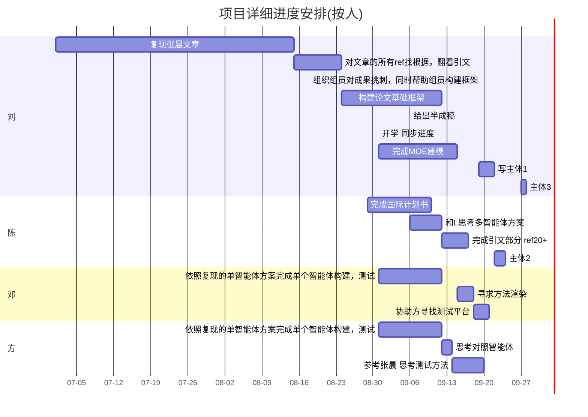
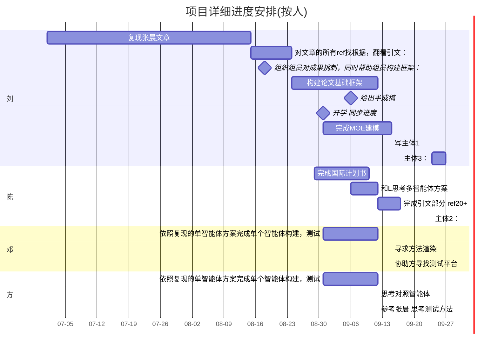
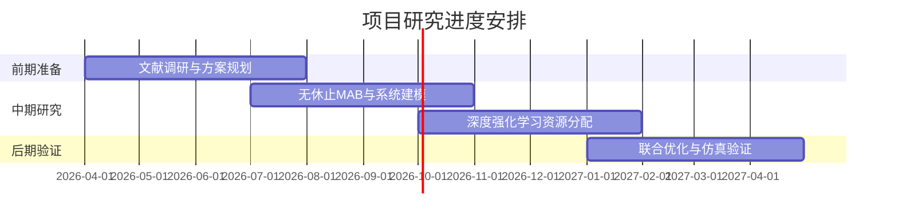
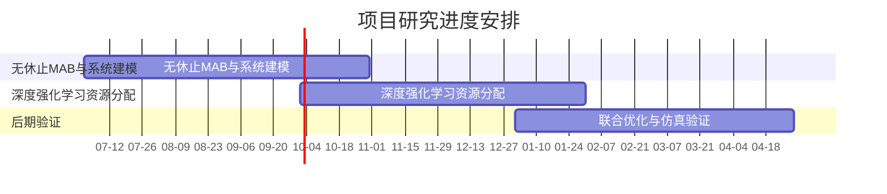

    <pre class="mermaid">
 
 

   </pre>

    section 项目节点
            无休止MAB与系统建模 :a2,26-07-01, 26-10-31
             主体完工:milestone,m1,26-08-31,26-10-6
            深度强化学习资源分配:a3,26-10-01, 27-01-31
            联合优化与仿真验证 :a4,27-01-01, 27-04-30

<h2>总体日程规划

<h3>详细日程规划

   

